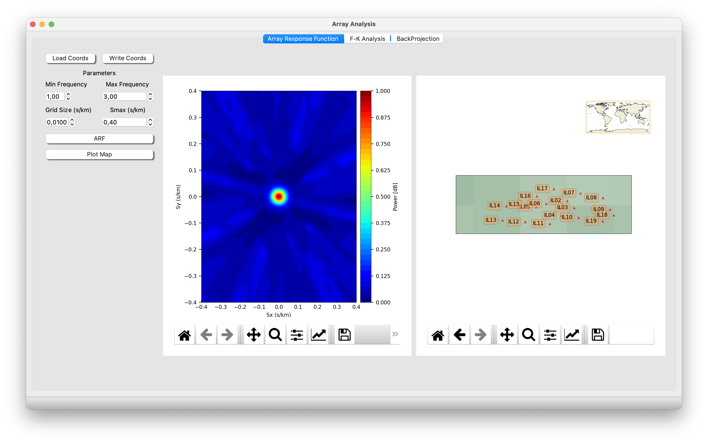
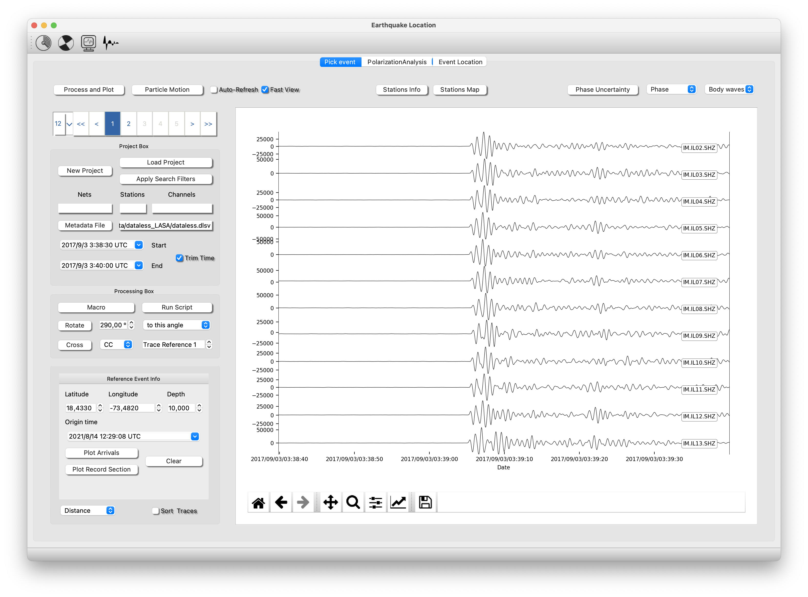
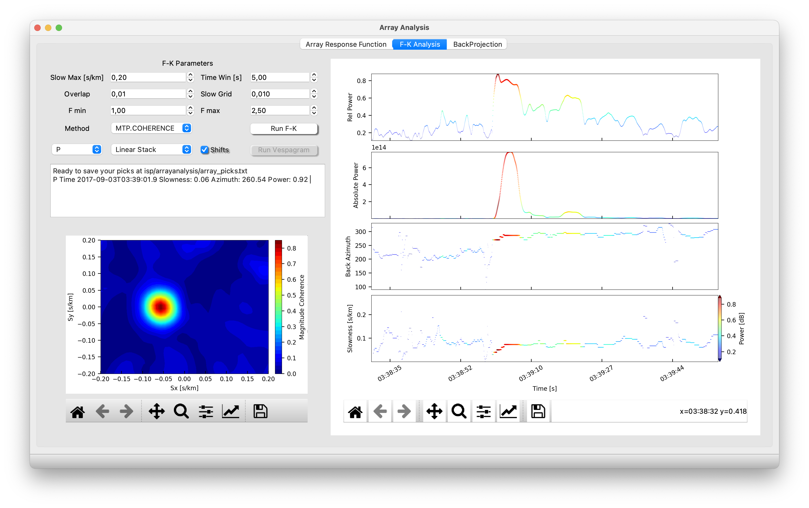
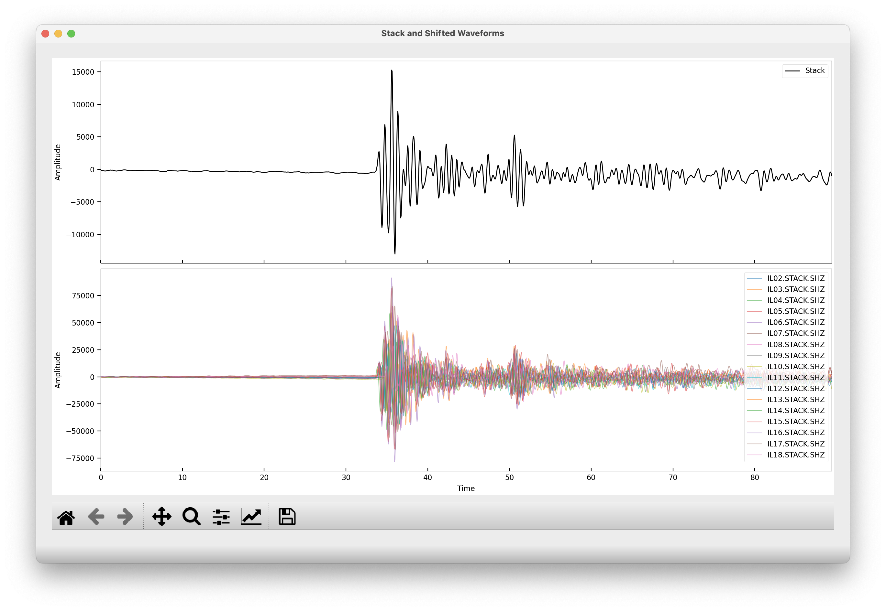
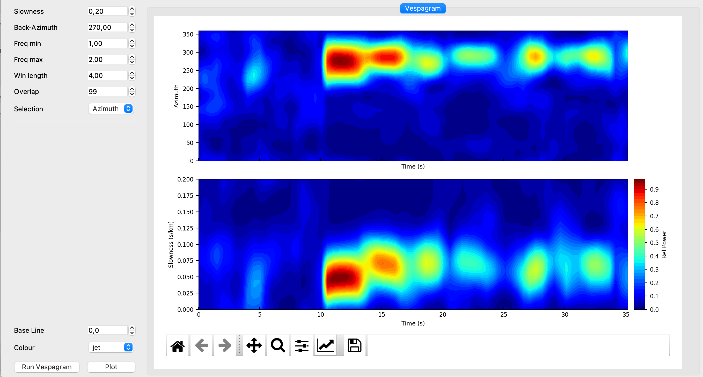
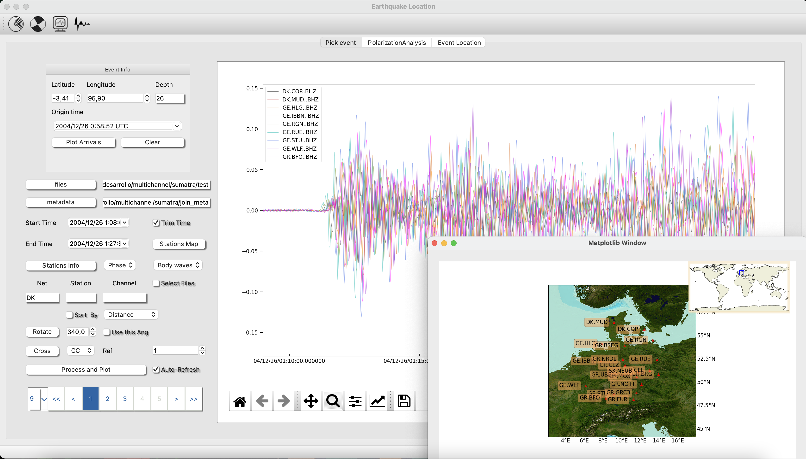
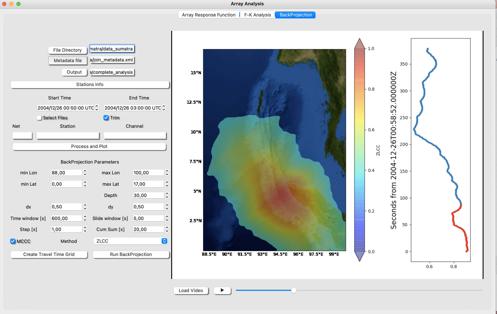

# Array Analysis

## Array Response Function (ARF)

The Array Response Function (ARF) (Ruigrok et al., 2017) helps to evaluate the resolution of the array in a specific bandwidth.

First you need to create a coordinates files and then load it. To create the coordinate file go to
“Files >>> Stations Coordinates” and fill the table with lat (o), lon (o) and depth (km). See this example:

<pre>
    <code>
Name      Lon         Lat     Depth
IL02  -146.864304  64.784698   261
IL03  -146.851196  64.771400   440
IL04  -146.876099  64.757004   528
IL05  -146.922897  64.773102   389
IL06  -146.904007  64.779198   262
    </code>
</pre>

This example of ccordinates files is available at: isp/arrayanalysis/stations/coordsLasa.txt

Then you can compute the ARF and plot the map with the array stations.

## Frequency-Wavenumber Analysis

The Frequency-Wavenumber (FK) is basically a method to compute the beamforming in the frequency domain (Capon, 1969).

To compute the FK you need follow this steps;

- Open Earthquake Analysis, then load a metadata (stations coordinates and instrument info). Clicking at Metadata File.

Then create a project or load a project, clicking at New Project / Load project. Next, process and plot your waveforms. Finally trim the event (check the box Trim Time) and click on the array analysis button on the top 

The figure below represents the seismograms: isp/examples/NuclearExplotionILAR_2017 and metadata at: isp/Metadata/dataless_LASA/dataless.dlsv

- Fill the parameters (Slowness Max, Time Window, overlap……)
- Choose methods
- Press Run F-K

Now, you will watch in the upper panels the Rel Power, Absolute Power, Back-Azimuth and Slowness results of your analysis. 

Two more actions:
Double pick at any of the upper panels will run the FK in that specific time window (starting in the point). Then, the slowness map will show up. if you check Shift, the stack and the shifted traces according to the maximum slowness vector will be process and plot. Additionally you can select the stacking method. The stack trace can be saved as miniseed, go to file save seismogram stack.

The stack trace can be saved as mseed file, click at file/write seismograms/stack.

The pick with the slowness vector corresponding to the phase you selected are automatically saved in the file “isp/arrayanalysis/array_picks.txt” and you can open the file just pressing “ctrl+o”.

- Fk Analysis 

- Traces Stack

## Vespagram

The vespagram is a visualization of the FK results for an specific backazimuth or slowness. So, once you have done the FK analysis, you can compute the vespagram (Rost and Thomas, 2002).

But before, you must select the time window. Go with the mouse to the any upper panel. Pick, hold and drag to the right direction to do the selection. The span time will be hilighted and then you can open the vespagram window.

In the vespagram window you can select the parameters (Win length, overlap, and frequency bandwidth of the analysis) and the backazimuth and slowness where you want to compute the vespagram.

- Vespagram

## Back Projection

The Back Projection is a relatively new technique (Kruger and Ohrnberger 2005) designed to quickly and effectively imaging rupture process of large earthquakes. Back-projecting seismic data can be done by big seismic arrays.

In ISP the user can process the seismograms and set the BackProjection parameters. It is shown a screenshot of the preparation of the data of Sumatra Earthquake using Earthquake Analysis module, and then using Back Projection tool.

First the user set the path to the seismograms, metadata and the output folder.
Second, the seismograms can be chopped and a macro with some signal processing can be established.
Then, the user must set the Back Projection parameters:

**Warning**. BackProjection is highly computing demanding, so we do not recomend using too high resolutions (dx = dy > 0.5), too long time window (time window < 800s) and too big grids (maxlat-minlat and maxlon - minlon < 15 degrees)

- Grid: set the minimum longitude and latitude and the maximum latitude and longitude as well as dx and dy (resolution in longitude and latitude in degrees) where the Back projection is going to be calculated. Set the depth.

- Time window is the whole period in which the BackProjection is going to be calculated. A small **sliding window** will be shifted forward in time in **step by step**.

- Click on generate the Travel Time Grid. This action will create a travel time grid in wich your grid cells have the travel time from every station to every lat and lon cell.

- Click on Run BackProjection. In every step will be calculated the Backprojcetion aligning the traces using the Multi Channel Cross Correlation technique (VanDecar and Crosson 1990) according to the Travel Time grid and estimating the power by a simple linear stack or using the Zero Lag Cross Correlation Technique (Almendros et al., 1999).

- Finally, Load the result video and play it.

## Multimedia Material (Array Analysis)

The following video shows a basic analysis of a nueclear explotion (Test from Nort Korea test 2017, Alaska Array ILAR)

<!-- blank line -->
<figure class="video_container">
  <video controls="true" allowfullscreen="true" poster="../img/poster_image.png" width="740" height="400">
    <source src="../img/array_new.mp4" type="video/mp4">
  </video>
</figure>
<!-- blank line -->
