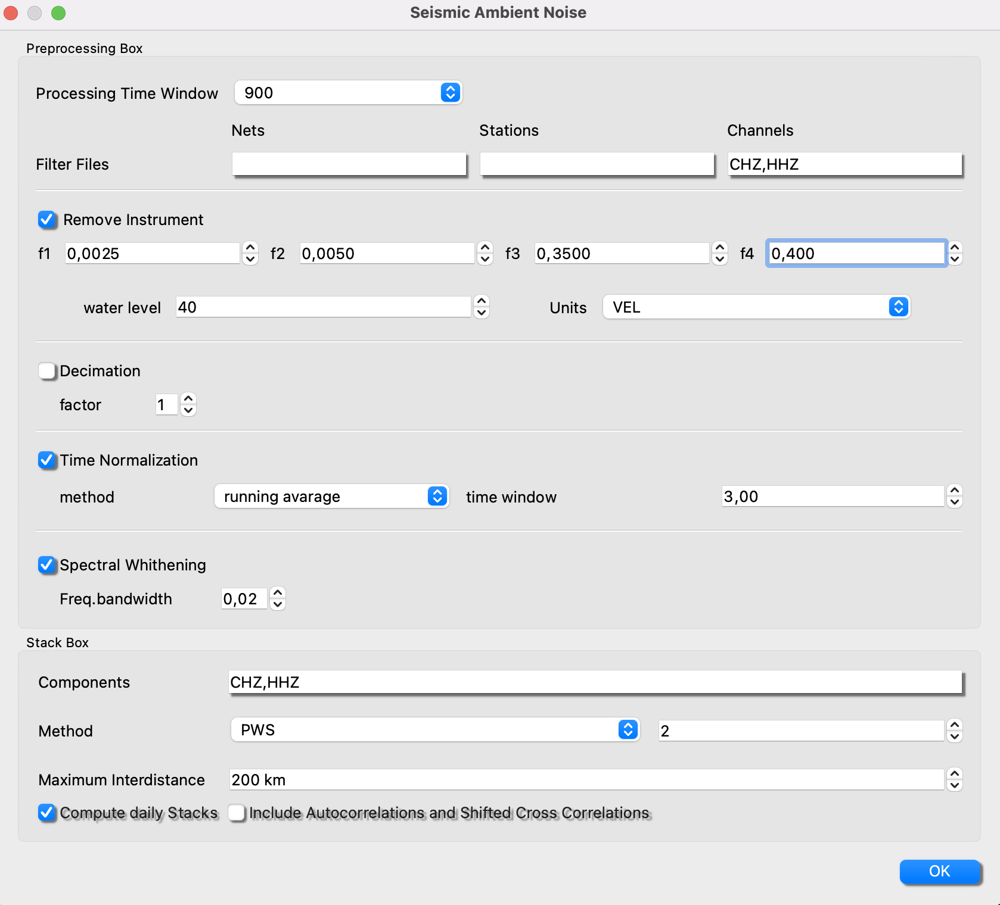
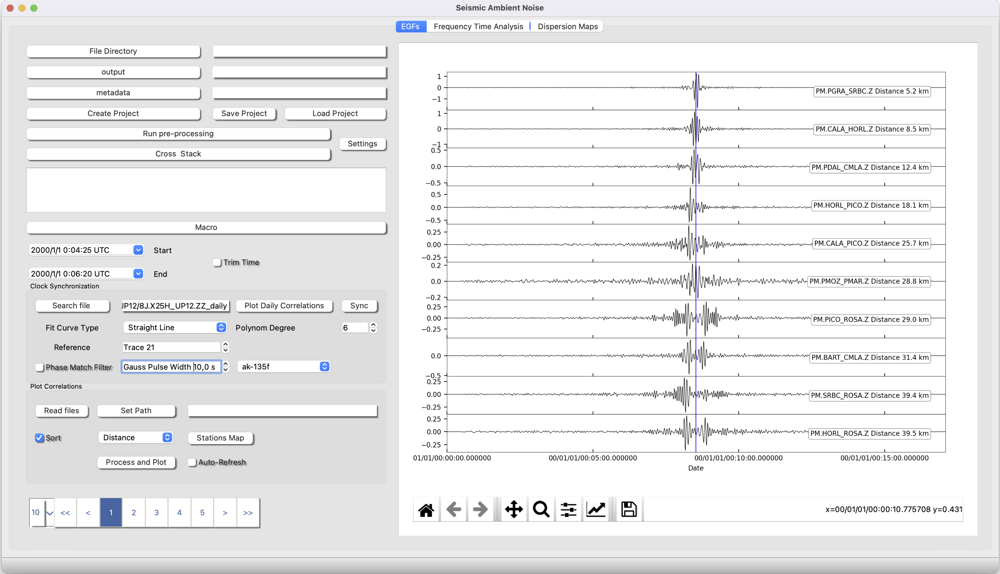
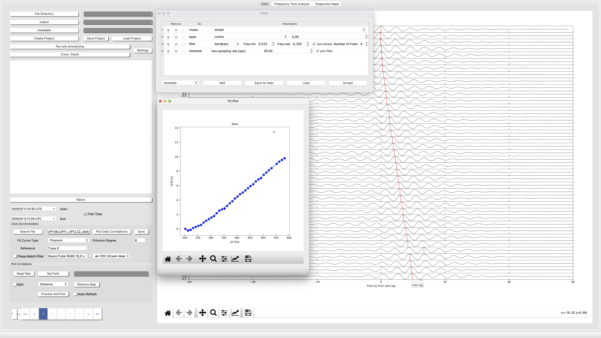
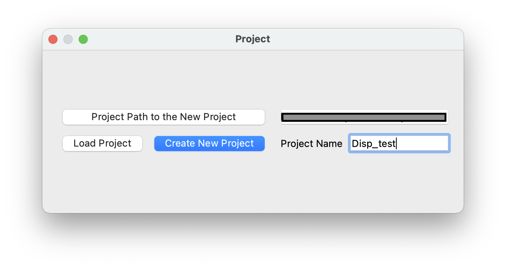
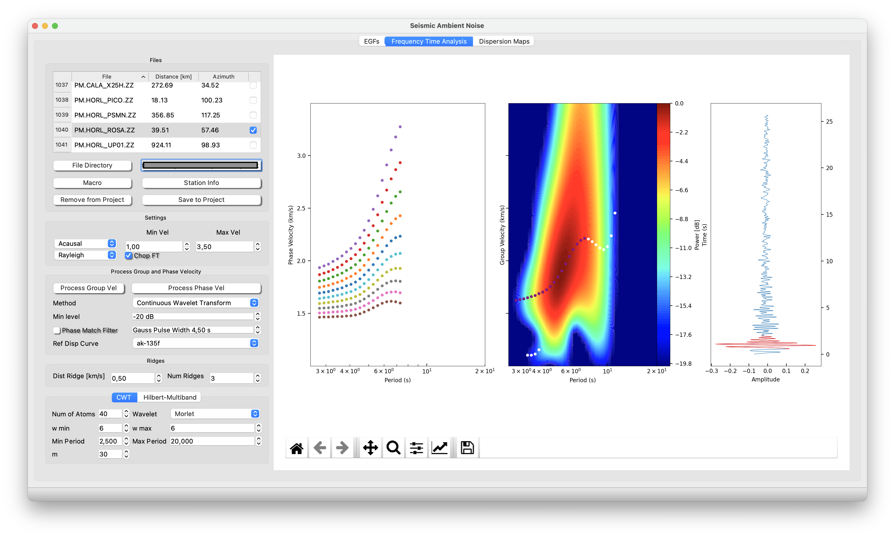
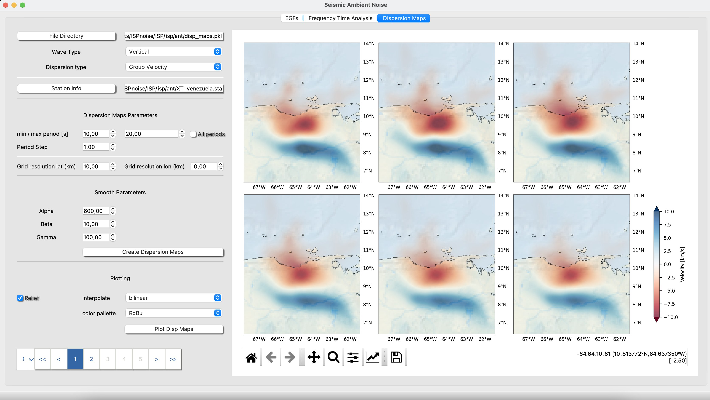

# Ambient Noise Tomography

The module ANT is divided in three main parts. First the toolbox designed to retrive Empirical Green Function, second the toolbos designed to measure phase and group velocity from the dispersion curves of EGs and third the toolbox to generate dispersion maps from the previous measurements.
In this tutorial is explained how to manage the module.

We recommend rreading Bensen et al., 2007 to understand the point EGF, Rusell et al., 1988 to understanf the Frequency-Time analysis and the Phase Match Filter,  and Barmin 2001 how to compute the Dispersion Maps.

***

## EGF

1 Setting Files Path & Metadata

To set the path to the metadata of your network and the path where you have hosted your seismogram files.

First, let's create a project. Set the path where you have the data files. They can be located in any kind of structure, for example in SDS arquitecture (*NETWORK/STATION/CHANNEL/FILES*) or simply everything in one single folder. WARNING!, create the project can take some time, do not desperate!.
Second, set the path where you have the metadata of all nets/stations/channels yo want to process.
	
2 Setting Parameters for the pre-processing steps of the EGFs

2.1. Processing Box

Processing Time Window: This is the time window in seconds that the daily seismograms files will be splitted to save the matrix of noise (see below for more details).

Filter Files: Might be you only want to generate a project for a set of stations "sta1,sta2,sta3..." or a set of channels "BHZ,HHZ". If you want everything just let the space empty.

Remove Instrumet: Set the four corner frequencies (very carefull with nyquist frequency of your data), the water level value and the output units. Even though this operation is computationally demanding, it is fully recommended to deconvolve your instrument to prevent from mixture cross-correlation of data from different instruments.

Decimate: Set the decimation factor. For example if you have HHZ (100hz), a good decimation factor would be 10 to set the new sampling rate to 10 Hz, which is enough to later measure dispersion.

Time Normalization: If is selected a running avarage, a moving median avarage filter of time window selected will be applied. If 1 bit is selected (not recommended) amplitudes will be mapped to (+1, -1).

Spectral Whithening: A moving avarage filter in the amplitude spectrum is applied with a bandwidth selected by the user.

 Then set the folder where you want the output of the pre-processing and the EGFs.

2.2. Stack Box

Components: Select the components that you want to cross correlate and stack. This operation allows ISP just select specific noise matrix to boost the speed of the stack.

Stacking Method:Select amoung Phase Wave stack, Linear and nth-root stack. Personally we recommend go for linear if you have several months of data and go for PWS if you have just few . Nth-rooth for testing and comparison with linear. The parameter is the power of the method in PWS or Nrooth (Do not change from 2 :-))

Maximum Intedistance: Because sometimes we do not want to mix EGFs with very long interdistance with short distance, ISP allows the user to filter the cross correlation and stack computation by maximum interdistance value.

Check Noise Matrix Output: If the user check *Compute daily Stacks*, ISP will compute the evolution of the EGFs in partial stacks of 20 days. If *Include Autocorrelations and Shifted Cross Correlations*, ISP will estimate all pssoble cross-correlations including autocorrelations e.g., ZZ and both cross-correlations (e.g., ZE and EZ). This option is mandatory to be checked if you want go for Transversal components to estimate dispersion curves of Love Waves.

3 Run pre-processing

Now, click on Run pre-processing. This action will load your settings and will make a database of the available files. Then the process will start to process the data.
	Finally per every station/channel a file will be saved containing a matrix with the noise data in frequency domain, ready to cross-correlate.

4 Run Stack

This action will load files from the pre-processing step and then for every channel-channel combination will do a cross correlation and stack all the stacks will be saved in the .outpur_directory/stack.

<!-- blank line -->

<!-- blank line -->

5 Explore your EGFs

In this point the user can set the path to the output files (hdf5 or sac files), read the files and then *process and plot*. The user can also establish a Macro to process the EGFs, plot a map and sort the EGFs by inter station distance. Notice that autocorrelations will be 0 distance.

Set Path Set the path to your stack output directory.

Read Files create a list ready to process and plot of the available stack EGF in the folder. If Sort is checked, the files will be sorted by inter-station distance or backazimth.

Process and Plot Process the EGFs of the list according to the macro previously established and then plot.

6 Explaining the output

When the user compute the preprocess, all information is saved in Noise Matrix per station/channel. The noise matrid is a 3D matrix in whic the first dimension or the rows are consecutive time windows of an split day, the seconddimension or the colums are the day and the third dimension or depth is the complex numers corresponding to the processed spectrum of the noise window. The matrix is saved as pickle with name "NWTSTACHANNEL". The matrix includes a column daily header "[julday1.year1",julday2.year1, .... ] and a numpy arrayy with the spectral information.

Afterwards, when the user press cross and stack, ISP combines the matrix information ifft(matrix_A*cong(matrix_B)) and then stack. 

Stack files shoul be named as follows "NET.STA1_STA2.CHN1CHN2". The stack files have format hdf5, basically a mseed with extra header info (e.g., inter-distance or inter-azimuth).

Stack_daily files are partial stacks with this aspect "NET.STA1_STA2.CHN1CHN2_daily", They are part of the output and basically are partial stacks of noise windows of 20 days shifted by default 10 days (50%). This is very useful to both, monitorize the evolution of noise and to synchonize Ocean Bottom Seismometers.

<pre>
    <code>
output_dir/matrix_files
outout_dir/stack/
output_dir/stack_daily/
output_dir/stack_rotated/
    </code>
</pre>

***

## Clock Synchronization

Clock Synchonization is very easy using ISP. Just select the station pair you want to synchronize Search file and th process (take the parameters from the macro) and plot Plot Daily Correlations. This action will be show the evolution of noise in partial stacks of 20 days. Now you can chop the signal pressing "q" for starttime and "e" and then check the trim box. 

Now select how do you want to fit your data, normaly a straight line but you can choose a plynom of degree up to 6. Press sync
Finally click and drag with the mouse and draw a free line over the points to be selected. Finally press enter. The output will be saved as a pickle dictionary:

<pre>
    <code>
isp/ant/clock_dir/STA1_STA2
where
STA1_STA2 keys = {clocks_station_name, Dates, Drift, Ref, R2}
    </code>
</pre>

***

## Dispersion Curves

Once you have generated the EGFs, it is time to measure the dispersion curves (phase and group velocity). We are going to explain how to use this module step by step.

1 Creating a Project

First of all, create a project by clicking in the upper diplaying pannels "Dispersion Curves/Manage Project" then will pop up this widget:

Ok, now set the path where you want to create the project and give it a name, next Create New Project. You will find an example of project at ant/disp_maps.pkl, that it is just a dicctionary with the information of the dispersion measurements. Later I will show you that this project is the entry to plot the Dispersion Maps.

2 **Time to measure dispersion** 

You can configurate your window as the figure below. Start with general configuration:

**Settings**:

Causal/Acausal: part of the quasi-symmetric EGF. This is the part that will be analyze in the process.

Rayleigh/Love: wave that will be saved to the project for info. Normally the user should select Raylegh for EGFs retrived from the verical components between pair of stations and Love for the horizontals.

**Process Phase and Group Velocity**:

Files Directory: Place the path where you have the stack files (see point 6 of the previous section).

Macros: Place the processing steps you with to apply to your EGF.

Method: For now tested Continuos Wavelet Transform with the Morlet Wavelet and using number of cycles 6 (perfect match between Fourier frequency and wavelet scales).

Min level: Set the minimum water level you want for your Frequency-Time analysis in Group Velocity

Phase Match Filter: This filter is applied to measure Group Velocity and basically takes a "Ref Disp Curve" and try to match it with your actual Dispersion curve. if you decide apply it you will notice the effect in both the time domain right pannel and in the Frequency-Time Group velocity pannel.

Process first Group then Phase velocity: Once It is plot the Time-Frequency plane of Group velocity (central pannel), the you can click (left button) and drag with your mouse to draw a free style line selecting all points that you consider for saving later. Once you close the draw, that point will appear in purple. Now, press process Phase velocity. You will see kind of several parallel curves. Same thing, click and drag to select all point with the same color.

3 **Save your stuff in your Project**

Save to Project: the dispersion measurements of Phase and Group Velocity. Once it is saved into the project, ISP wil check the box correspong to the file and print in the terminal.

Remove from Project: a measurement just highlighting a checked file and press this button to remove the wrong measure from your project.

***

## Dispersion Maps

In a very simple way you will plot Dispersion Maps.

Set the path to your project: Remind you that you have available an example at isp/anddisp_maps.pkl.

Now you must tell ISP where to find the information you want to plot. You can do it as follows:

Select the wave type Vertical/Rayleigh Wave Hrizontal/Love Wave

Dispersion type Group/Phase Velocity

Then, set some parametriztion related to resolution and smoothing

Dispersion Maps Parameters: Set the minimum and maximum Period in which to want to compute the analysis or just check all periods to compute everything possible inside your project.

Period Step: It is the period step in which you want to compute every map. Every One second is more than enougth do not be crazy! :-).

Grid resolution: It is is the estimated spatial resolution that you expect for your maps. It depends on the geometry of your network, the interdistance and the maximum distance between staion pairs.

Dispersion Maps Smoothing Parameters (see Barmin 2001 to understand the effect of the regularization parameters). Our own advice is if you want high detail go foe a = 600, but if you want high smoothing go for a = 1000. Let b = 10 and gamma = 100.

We are developing the resolution maps and checkboard test. Just give us a chance

