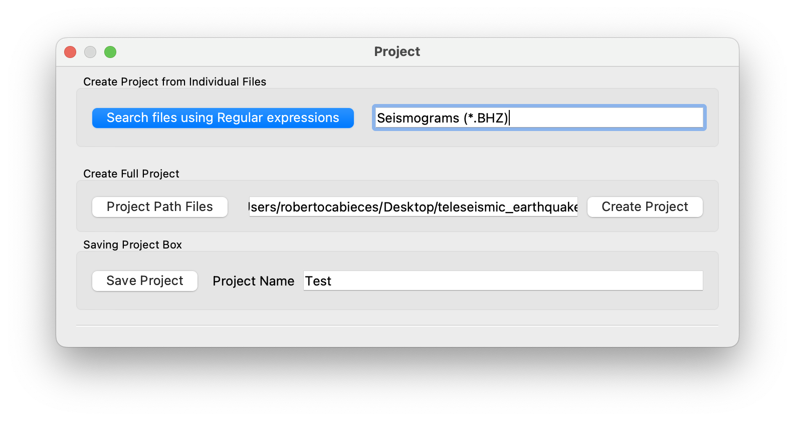
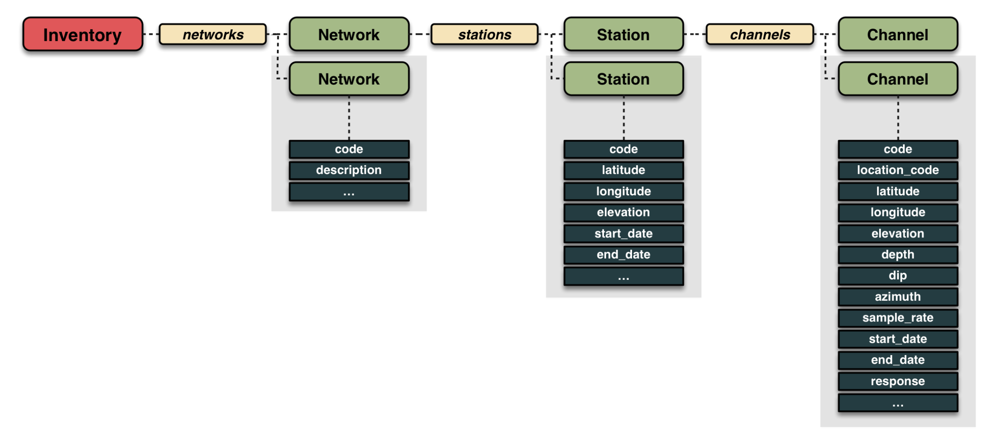

# Warming tutorial

This section will show you the overall structure of the project and a basic idea of how are the data managed by ISP.

***
## Description

In ISP we have decided go for miniseed format, with is one of the most broadly used data storage formats for seismograms. The best description is given at [mseed](http://ds.iris.edu/ds/nodes/dmc/data/formats/miniseed/) which is simply:

MiniSEED is the subset of the SEED standard that is used for time series data. Very limited metadata for the time series is included in miniSEED beyond time series identification and simple state-of-health flags. In particular, geographic coordinates, response/scaling information and other information needed to interpret the data values are not included.

Time series are stored as generally independent, fixed length data records which each contain a small segment of contiguous series values. A reader of miniSEED is required to reconstruct longer, contiguous time series from the data record segments. Common record lengths are 512-byte (for real time streams) and 4096-byte (for archiving), other record lengths are used for special scenarios.

A “file” or “stream” of miniSEED is simply a concatenation of data records. Depending on the capabilities of the intended reader the data records for multiple channels of data may be multiplexed together.

## Project: Seismograms and metadata

### Create a Project from seismogram files

We start explaining how to start a project inside Earthquake Analysis module (more details inside sections). First of all you need to create a project. A project is basically a "dictionary file" that tells your computer where are your valid data. This strategy makes easier to explore your big data.

Now, let's create a new project pressing the button "New Project"





You will find this dialog that will guide you to crete the project. Two option:
Create Project from individual files, you will select individual files that going to be part of your project.
Create Full Project, you give the path to the folder tree where you have your daily data files. ISP will scan all folders validating the files and will create the project.
Afterwards, you can save your project (recommended) giving a name and press "Saving Project".
Becareful, when you start to create a project ISP will capture the search filters, so for example if in the Project Box Channels is selected "BHZ" as in the picture below, the project will created based on this filters- If you do not want any filter set the filter bocxes empty


Filters boxes uses [Regex](https://en.wikipedia.org/wiki/Regular_expression) and [Python keywords](https://www.educative.io/answers/how-to-implement-wildcards-in-python):

For example, if ypu want search any component in channels "BH." or if you want any station but verical component station ".+" channel BHZ.

Very important, you can reload your project aplying searching filters simply by pressing "r" outside the plot window. This action also takes into account if trim is checked to cut the time window. This is very useful to search for specific time windows where you already knows in advance that there is an event there.

## Project Video Tutorial
The following video shows how to create a project, make searches by wildcards and how to search by specific time windows.

<!-- blank line -->
<figure class="video_container">
  <video controls="true" allowfullscreen="true" poster="../img/poster_image.png" width="740" height="400">
    <source src="../img/Project.mp4" type="video/mp4">
  </video>
</figure>
<!-- blank line -->

---


### Metadata (Dataless and *.xml)

ISP uses two kind of metadata files either Dataless or xml. (*https://docs.obspy.org/tutorial/code_snippets/stationxml_file_from_scratch.html*). 
You can find an example of this files at the folders isp/Metadata/dataless and isp/Metadata/xml. As you will see, in the this files there is information structured as a dictionary nets/stations/channels. Personally, the best way to make your own metadata file is using either the java software [PDCC](https://ds.iris.edu/ds/nodes/dmc/software/downloads/pdcc/) or going to the [API Station Management Portal](https://smp.gempa.de/).


**Important**: The idea in ISP is that your Metadata file (one single file) contains all of the information (such as coordinates of your stations, instrument response, sampling frequency and so on ...) of the miniseed files you are going to manage. The reason of this design is that, it is easier to programming something that works independently from the miniseed file to metadata. For example when sorting the minified files from respect to an event. The software internally reads the name of all of your files (in the header) and  then match this info with the metadata file.

**Notes**: It is very easy using python to convert your dataless to xml.
From: *https://docs.obspy.org/_modules/obspy/core/inventory/inventory.html#Inventory.write*
```bash
from obspy import read_inventory
inv = read_inventory("path_to_your_dataless")
inv.write(path_or_file_object, format="stationxml", validate=True)
```


