# Earthquake Location

The module Earthquake analysis allows you to analyse waveforms, polarization analysis of seismograms 3-components, calculate earthquake source parameters, locate an event and estimate the focal mechanisms (First Polarity). We will walk through all of the functionality following this scheme:
***
## Event Analysis

From top to bottom in the left side of the window you will see:

- **Event Info**: This small box let enter information about an event, in this way you can plot the theoretical arrivals (ak-135F) with respect your seismograms, clicking the button Plot Arrivals. Plot arrivals requires that you have correctly loaded your metadata. You can also Plot the record section, seismograms sorted according to the distance and ploting the theretical arrivals. Inside File > Open Settings, you can select wich phases you want to plot. In case you want select all arrivals, type "ALL" in the Settings box.

- **Metadata File**: By clicking in this button you will place the path to you metadata file. The metadata file must contain the information of all of the stations seismograms you want to analyse (metadata must be a *xml or *dlsv).

- **Start Time and End Time**: The time boxes can be selected checking “Trim Time”. If you choose this option all the seismograms will be cut in accordance with the selected time window. Use the shortcuts "Q" and "E" to set over the plot automatically the trim stat time and endtime.

- **Stations Info**: will deploy a table with the fundamental information of the seismograms.

- **Phase box**: This combo box allow the selection of specific phases for picking it in the seismograms. 

- **Waves box**: You can choose Body, surface, coda or noise. With this selected you can highlight a time window of the seismogram for further analysis. The selection are saved inside a dictionary that can be directly used running your own script. See run script to see details.

- **Net, Station and Channel**: You can fill this boxes (also using wildcards such as * or BH?) to select specific files from your files folder (check “select files”).

- **Stations Map**: will show you the location of the stations that corresponds to the seismograms of your folder. The seismograms metadata must match with the metadata information.

- **Rotate**: This option will rotate all your station - 3 components (channels must be named N,E,Z) to the Great Arc Circle taking the reference the data of Event info tab. Check "Use this Ang" to rotate the components a specific angle.

- **Cross**: This button will compute the cross-correlation (cc) or the autocorrelation of all processed seismograms with respect the reference “Ref”, the number of the seismogram from top to bottom.

- **Process and Plot**: This action will read the seismograms from the database of paths to your seismograms, created from your folder tree (database already built using Read Files) and will carry out the processing from the established “MACRO”. Further details in MACRO section "Macros".

- **Particle Motion**: This action will plor the particle motion from your vertical and N,E or R,T components. This actions works when you have this three waveforms on screen and are trimed. The sam actioon can be also done in the module Polarization Analysis.

- **Run Script**: This is on of the most important actions. Basically it runs a python script that you can have storaged at ISP/isp/scripts/your_scriptX.py. The name of the script is up to you however, you might edit the __init__.py. For example imagine you want to run from ISP your_script1.py. 

First step edit the ISP/isp/scripts/__init__.py:

<pre>
    <code>
from .your_script1 import run_process
    </code>
</pre>

Second step the fill the folder with the script you want to run:

The structure of this folder ISP/isp/scripts is as follows:

<pre>
    <code>
    __init__.py
    your_script1.py
    </code>
</pre>

Here you can set which script you want to edit by changing ".your_script1" 

Inside ISP/isp/scripts/script.py you will find an example ready to run by clicking Run Script button. In this example, the action will take the waveform 1 and waveform 2 from the stream ObsPy object and will add their data. Then, the wavform will be plot in a separate window. Of course this two traces must have the same numer of samples!.

<pre>
    <code>
#!/usr/bin/env python
# -*- coding: utf-8 -*-

"""
script.py
"""

from obspy import Stream, UTCDateTime
import matplotlib.pyplot as plt
import matplotlib
matplotlib.use('Qt5Agg')

def run_process(st: Stream, chop: dict, starttime: UTCDateTime, endtime: UTCDateTime, hypo_lat: float,
                hypo_lon: float, hypo_depth_km: float, hypo_origin_time: UTCDateTime):

    """
    example of how to design your running script
    chop = {'Body waves': {}, 'Surf Waves': {}, 'Coda': {}, 'Noise': {}}: dict
    id = {id: [metadata, t, s, xmin_index, xmax_index, t_start_utc, t_end_utc]}
    metadata = [dic_metadata['net'], dic_metadata['station'], dic_metadata['location'], dic_metadata['channel'],
            dic_metadata['starttime'], dic_metadata['endtime'], dic_metadata['sampling_rate'],
            dic_metadata['npts']]

    # example of chop_full_dict_input = {'Body waves':{"WM.SFS..HHZ": [[WM, SFS,,HHZ,...], time_amplitudes, amplitudes,...
    """

    try:

        data = st[0].data + st[1].data

        fig, ax1 = plt.subplots(1, 1, layout='constrained')
        ax1.plot(st[0].times(), data)
        ax1.set_xlabel('Time (s)')
        ax1.set_ylabel('Trace1 + Trace')
        ax1.grid(True)
        plt.show()

    except Exception as e:
        # Handle any exception and print the error message
        print("An error occurred:", str(e))

    </code>
</pre>

Important details:

- The only constrain is that the method must be always named run_process and must have the the same inputs of the example.

- All inputs are taken from the main Earthquake Location GUI and can be used or not.

Additional options from the toolbar are:

										File

File: Project will open the box to assist you in managing a project (load or create a new project).

File: New location will clean the picks that are saved automatically for be ready to compute new picking/location.

File: Write Files will write in the folder you select the processed seismograms. The seismograms will be saved in mseed format. Moreove, you can write mseed files containing the Charachteristic Functions such as STA/LTA, Cross Correlations or the stack.

File: Open Settings will open a window with the specific parameters of the subprocess that 
you can carry out in this module (sta/lta, wavelet detection, entropy, plor record section phases).

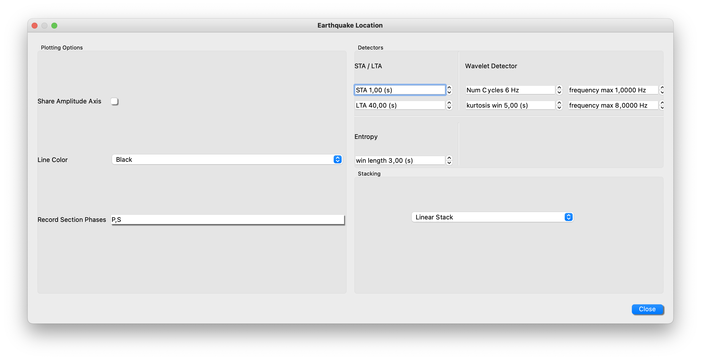

										Actions

Actions:  Open Picks will open the file with the information of your picks. You can also open the file from here. Shortcut "Ctr + u". 
Picks are saved in *ISP/isp/earthquakeAnalysis/location_output/obs/output.txt*

Actions:  Picks Remove will clean the pick file.

<pre>
    <code>
Station_name Instrument Component P_phase_onset P_phase_descriptor First_Motion Date Hour_min Seconds GAU Err Coda_duration Amplitude Period
PMG ? BHZ ? P ? 20221018 1150 24.693 GAU 0.00E+00 0.0 -3024.00 0.0
    </code>
</pre>

Actions:  Macro will deploy a window with all of the processing options. All of the processing options will be applied once you press the button Processing and Plot.

Action:  Clean Events Detected will clean the events associated in the coincidence trigger or events associator. This events are obtained after picking in Auto pick / associate.

Action:  Data availability will plot the data availability (backlines) for each station/component of your project.

Action:  Concatenate Waveforms will automatically concatenate waveforms with the same net, station and channel name from different days. This is specially useful to analyze waveforms from teleseismic events splited in two different files.

Action:  Search in Catalog (see the figure below) is a widget designed to plot your catalog and select an event to search in your project. The catalog can be either a csv file with this header (example below) or a *catalog* with an specific [file formats](https://docs.obspy.org/packages/autogen/obspy.core.event.read_events.html) such as *QUAKEML*, *SC3ML*, *CMTSOLUTION* and so on. 

To facilitate the selection of events, the user can press "t" over the epicenter in the map to hilight it in the table. Finally, Pressing button "Select Event" the information is sent to the trim starttime and endtime and to the Event Box. Ready to filter your project to make the search of the event and show your waveforms! You can find an example in isp/examples/catalog. See the [**video**](https://projectisp.github.io/ISP_tutorial.github.io/el/#multimedia-material)

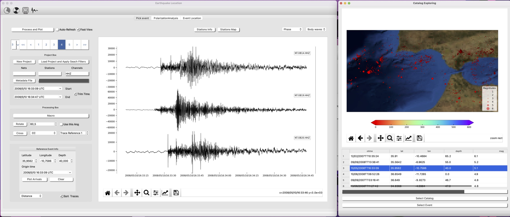

<pre>
    <code>
Date;Time;Latitude;Longitude;Depth;Magnitude;mag_type
01/01/2007;02:03:03;34.9608;-4.0459;12.0;2.6;Mw
    </code>
</pre>

										Compute

Compute:  STA/LTA from all processed seismograms and will plot the result together. STA/LTA takes the parameters from Parameters Settings.

Compute:  CWT (CF) from all processed seismograms and will plot the result together. CWT takes the parameters from Parameters Settings.

Compute:  Envelope from all processed seismograms and will plot the result together. 

Compute:  Spectral Entropy from all processed seismograms and will plot the result together. Spectral entropy is estimated in small time windows see Parameters Settings.

Compute: All Seismograms: Plot together all seismograms.

Compute:  Stack run (linear, nth-root or PWS) stack of all processed seismograms. Set your choice in File/Open Settings.

Compute:  Plot Record Section  will plot the waveforms according to distance and will also plot the travel times. This action is available just when you have process and plot your waveforms and sorted by distance. Be careful, you need a correct metadata file loaded and also the event info box corretly filled. This action could take some time.

                                        Go

Will ship you to the rest of ISP modules (Array analysis, Moment Tensor Inversion, Time-Frequency and RFs mudules). By clicking on one of this module you will send the information of the seismograms and metadata to the other modules. Please see Array analysis and Moment Tensor for further details and examples. 

For xample, If you press letter "m" over a seismogram, then you can click on the TF module picture to analyse the selected waveform in the tf plane. Go to [**Connect with Earthquake Analysis**](https://projectisp.github.io/ISP_tutorial.github.io/tf/#connect-with-earthquake-analysis), for a fully explanation an example.

                                        Align Traces

Align Traces: From Phase Pick will align the trace with respect the picks of the selected phase in the phase box. For example, this can be very useful to align the first arriaval, let's say P-wave of an event for all traces.

Align Traces: From Starttime will set the same starttime to all traces. This is useful if you want to compare seismograms from different days.

Align Traces: Using MCCC Multi Channel Cross Correlation technicque to find the best way to align all traces. This technique is very efficient when the user expect high coherence between waveforms. For example teleseismic events, or events detected in a coherent array.

                                        Selections

Action:  Clean Selection will remove an specific seismogram time window selection, such as Body wave,  see the combo box selected and will delete from the selections.

Action:  Remove all selections

                                        Import

Import: Picks from file It will plot the picks from selected file in the corresponding waveforms. The picks from the file that the user select must be in the ISP/NLL format as it is shown above Actions:Picks.

***

## Shortcuts

Earthquake analysis module keywords and mouse shortcuts. Generally there are shortcuts to be used inside plots and other shortcuts to be used to run actions.

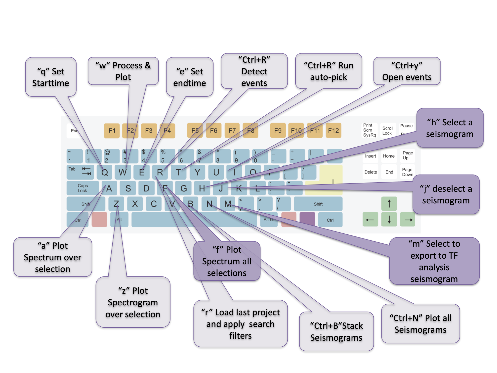

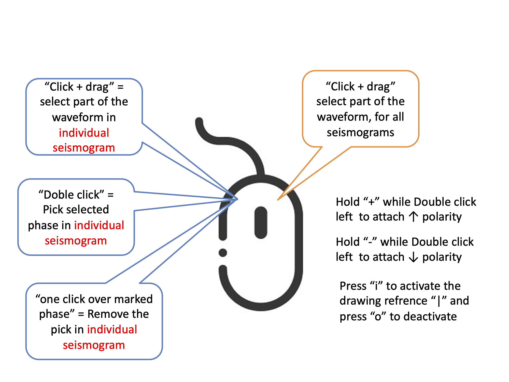

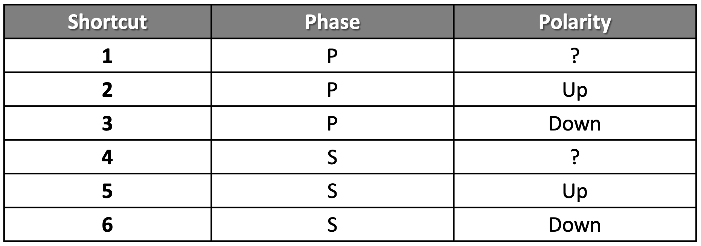

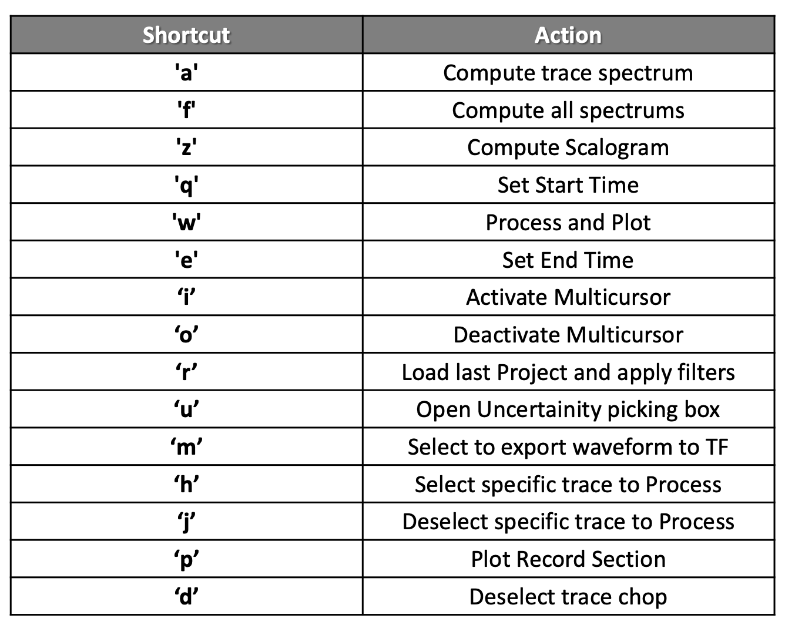

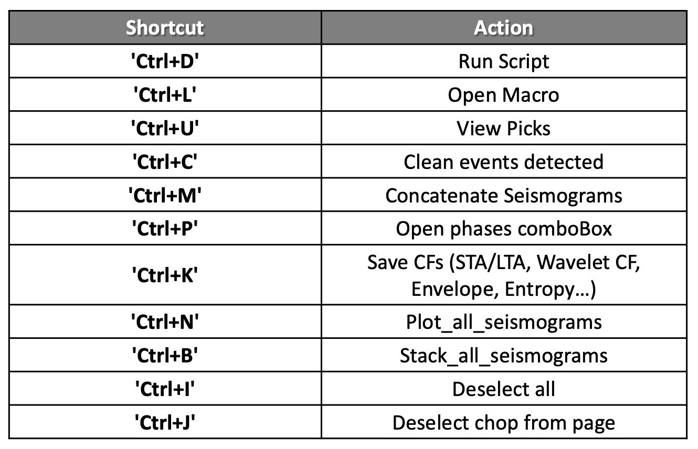

## Polarisation Analysis

The Polarization Analysis is designed to analyze the three seismograms components from a station.
You can freely rotate using the rotation RT or the LQT your NEZ components an angle (Rot Angle) with an Incidence angle (Inc Angle).

The Particle motion of the processed seismogram is view clicking in “Plot Polarization”. This option will plot all the time window in a 3D view and in three 2D plot views.

If you want to make a sliding window analysis of the polarization press  “Polarization Analysis”. This will carry out a polarization analysis on windows length and frequency bandwidth specified by the user over the full analyzed seismogram.

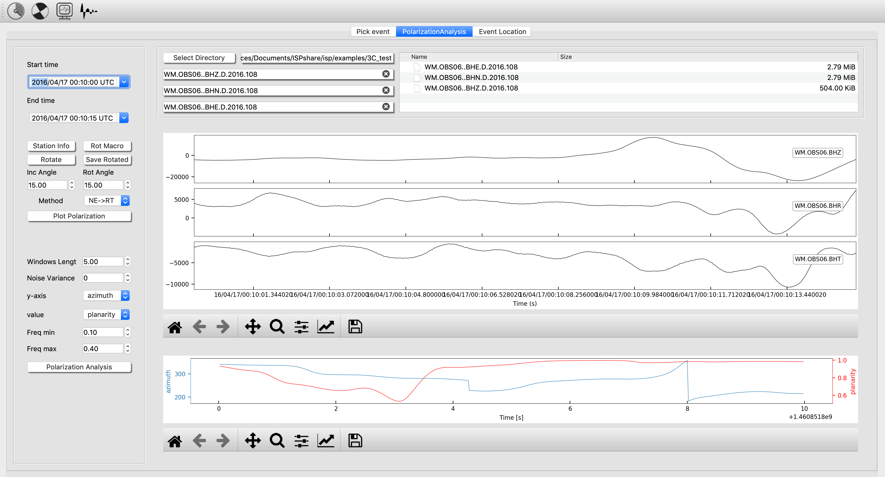

For a full particle motion analysis, press “Plot Polarization”. This will open another window with a 3D particle motion on the left and the three characteristic views on the right.

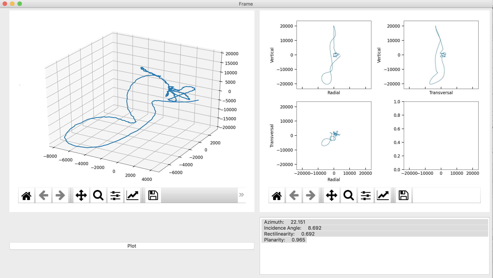

***

## Event Location

In the Event Location Frame the user can configure the velocity grid 1D/3D model, locate earthquakes and compute Focal Mechanisms.

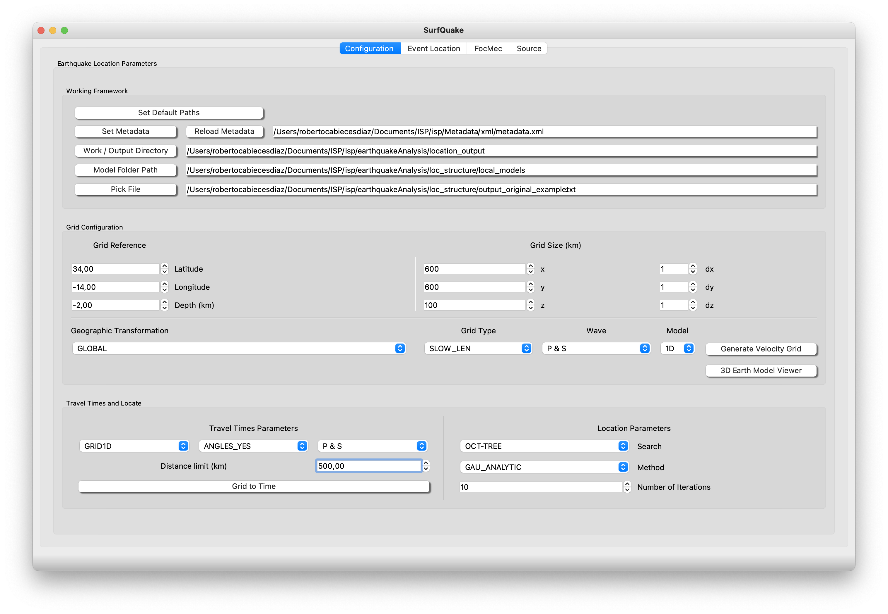

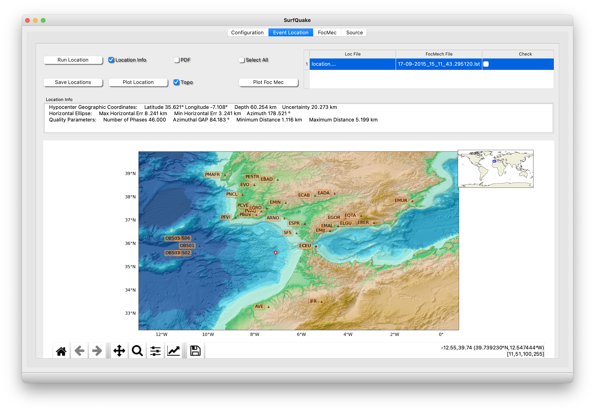

- **Grid Reference**:

First it is needed to set a Velocity grid framework (Grid reference and transformation type are mandatory). For now is only available Transformation Simple and Global.

- **Grid Size**:

Next, the Grid dimensions (Grid Size). Case 1D the dimension in the *x* coordinate  always must be 2 and the grid reference is refered to the corner SW. Case 3D the grid reference is the center of the Grid.
Choose the grid type and the wave and then generate the velocity model binary files by clicking “Generate Velocity Grid”. Please follow the scheme of the next figure to set correctly your 3D grid frame. 

For example, First the user would place the center of the grid in case you want the center of a 1D grid:
Grid reference 34.0 Latitude, -14.0 Longitude and -1 (1 km in topography). Grid Size x = 2 (always) dx = 1, y = 2000 dy =1 and z = 200 dz = 1. Tha means an aproximate square region of **radio** 2000x2000x150 km with the reference at (34,-14,-1).

Second, for the 3D case, the user must set the Grid reference also 37.0 Latitude, -9.0 Longitude and -1 (1 km in topography), but the Grid Size is refered to the distance from the grid reference. So, for example, Grid Size x = 881 dx = 1, y = 661 dy =1 and z = 61 dz = 1. This means a grid centered at 37.0,-9.0,-1.0 with a extension of **diameter** (881,661,60), see image below.

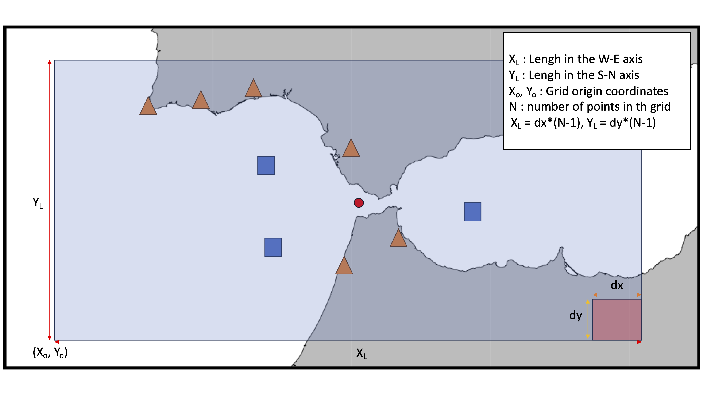

Once the binary files are generated you can check the results in the folder:

ISP/earthquakeAnalysis/location_output/model

- Where and how place the velocity 1D model?:
isp/earthquakeAnalysis/location_output/local_models

1D models (see example):

For the *P-wave* the file must named modelP and for the *S-wave* "modelS"

<pre>
    <code>
LAYER   0.0  6.1 0.0    3.49  0.0  2.7 0.0
LAYER  11.0  6.4 0.0    3.66  0.0  2.7 0.0
LAYER  24.0  6.9 0.0    3.94  0.0  2.7 0.0
LAYER  31.0  8.0 0.0    4.57  0.0  2.7 0.0
LAYER  ....  ... ...    ....  ...  ... ...
    </code>
</pre>

- Where and how place the velocity 3D model?:
isp/earthquakeAnalysis/location_output/model3D

We have created a repository with an example of [**3D model**](https://github.com/rcabdia/ProjectISP_3Dmodels)

Every depth layer must be placed in files called, for example

<pre>
    <code>
For the P wave --> layer.P.mod5.mod
For the S wave --> layer.S.mod5.mod
    </code>
</pre>

Which means that inside this file there is the grid for the layer at depth 5km.

The layer must be a matrix with the values in the rows from top to bottom S to N and from left to right E to W. That's mean following the next example that the file corresponding to a depth layer 5km "layer.P.mod5.mod" could be like this:

<pre>
    <code>
4.5759 4.5735 4.5707 4.5677
4.5760 4.5755 4.5766 4.5670
...... ...... ...... ......
4.6800 4.650 4.67300 4.5678
    </code>
</pre>

This matrix means that, for example corresponds to geographic points (separated in cells of, dx dy of 0.5 x 0.5 degrees: Warning grid cells must be [dx = dy = dz] for a correct interpretation.

<pre>
    <code>
(-10.0,34) (-9.5,34) (-9.0,34) (-8.5,34)
(-10.0,34.5) (-9.5,34.5) (-9.0,34.5) (-8.5,34.5)
........ ......... ......... .........
(-10.0,40.0) (-9.5,40.0) (-9.0,40.0) (-8.5,40.0)
    </code>
</pre>

The most important step is to generate the travel-times for all the stations inside the maximum distance the user determine.  Please be sure that you have load previously the metadata (this is necessary to associate your picks with your station coordinates).

The generated **travel-times** will save in 

**ISP/earthquakeAnalysis/location_output/time**, for example with the following name "layer.P.EBAD.time.buf"

Once you have complete the above steps you can locate the earthquake and the focal mechanism. The above operation are just necessary to be implemented  the first time you use a specific Earth model.

**For global is not necessary generate the velocity grid and travel times**.
 
To visualize the detailed Probability Density Function, press “Plot PDF”, once you have already carried out the location.

The Earth Model Viewer is intended to help to visualize 3D Earth velocity models as in the figure below.
Just select the binary file *.buf (can be generated from the model as described in previous section). Next, select the depth of the layer, the cross sections in longitude and latitude and the press plot.

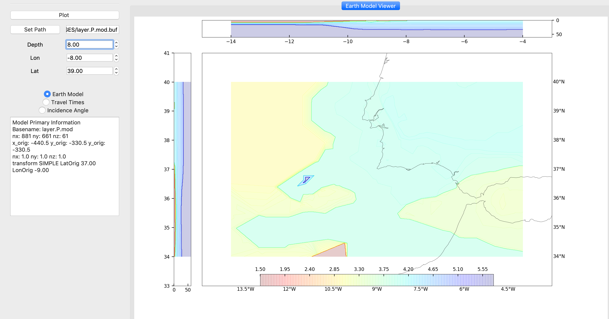

Moreover, if you have picked the seismic phases and have been designated the polarity in “Event frame” , you will be able to  obtain the Focal Mechanism (it uses the subprogram FocMec)

***
## Focal Mechanism - First Polarity

The run script that manage FocMec behind ISP is in the file **./isp/EartuqakeAnalysis/location_output/first_polarity/focmec_run**.

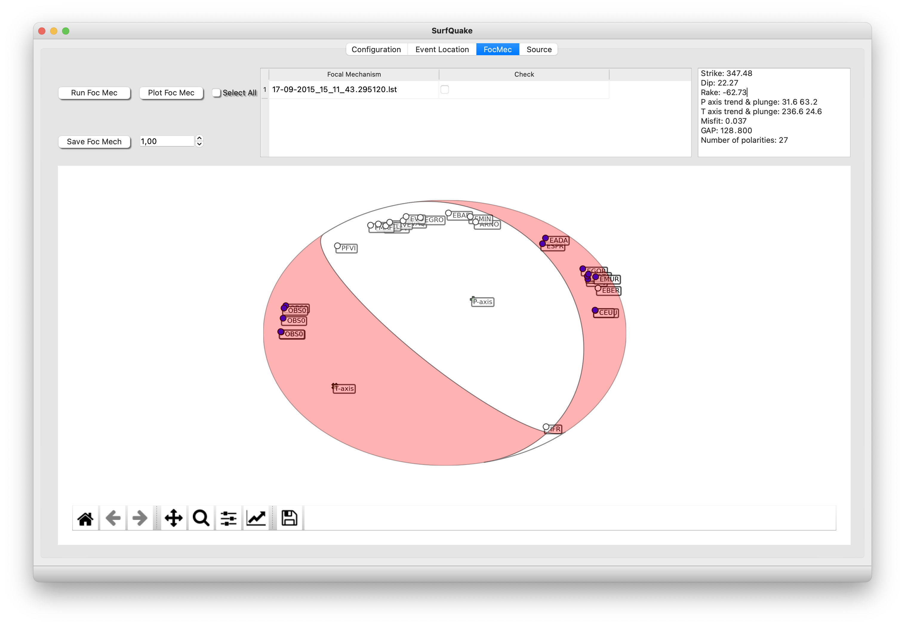

<pre>
    <code>
mechanism.out
No comments
\* Comment is previous line: Input file for focmec is next
test.inp
y     Use emergent arrivals?  [y]
    correct file  [y]
y   relative weighting..[y]
0.0     allowed P polarity erors..[0]
100 exit after this many acceptable solutions...[100]
    minimum B trend  [0]
    B increment  [5]
    maximum B trend  [355]
    min B plunge..[0]
    increment  [5]
    maximum..[90]
    minimum Angle..[0]
    increment  [5]
    maximum  [175]
    </code>
</pre>

Indeed what is most important is to play with the value "allowed P polarity erors", by default set to 0.0.

***
## Spectral Analysis - Source Parameters

### Moment Magnitude

This module is based on [SourceSpec v1.7](https://sourcespec.readthedocs.io/en/stable/) and it uses the location storaged in the folder Loc Folder (hyp files) to estimate the event source parameters (seismic moment, corner frequency, radiated energy, source size, static stress drop, apparent stress).

The configuration file that ISP points to is placed at:

ISP/isp/source_spec_parse/config/source_spec.conf

The user can modify the configuration as well as the GUI (below) entry points from ISP.

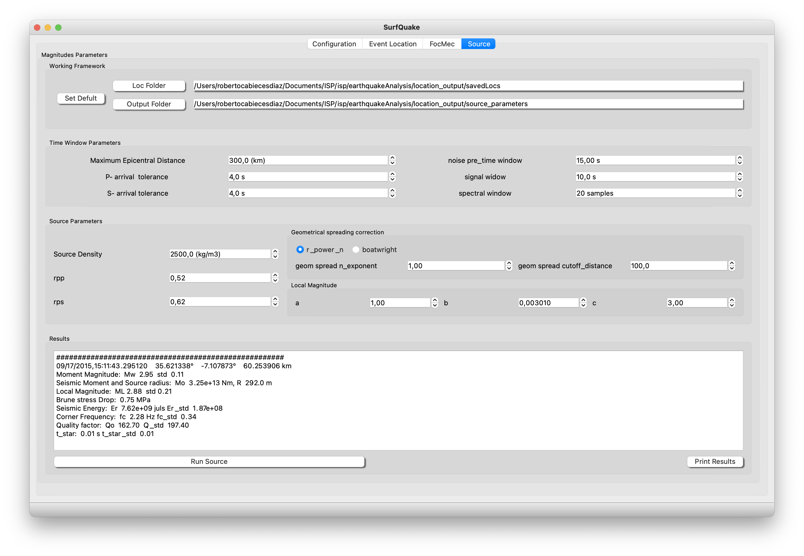

Complementary Magnitudes (work in progress):

With the [Magnitude Estimation](http://www.isc.ac.uk/standards/magnitudes/) you can calculate):
Body-wave (mb), Surface-wave (Ms) and Coda Magnitude (Mc).

## Phase Picking and Associator

The Picking algorythm of ISP/surfQuake uses the Deep Neural Network of Phasenet ([Zhu and Beroza, 2019](https://academic.oup.com/gji/article/216/1/261/5129142)) to estimate the arrival times of P- and S-wave. The arrival times are saved as a csv file and in daily folders to be ready to be used by the associator. Example of csv header:

    date,fname,year,month,day,net,station,flag,tt,date_time,weight,amplitude,phase
    20220131,CA.ARBS.P,2022,1,31,CA,ARBS,1,39383.88,2022-01-31T10:56:23.880000,0.53,8557892.7,P
    20220131,CA.ARBS.S,2022,1,31,CA,ARBS,1,85480.59,2022-01-31T23:44:40.590000,0.30,8481788.2,S

Be sure you have just created a [Project](https://projectisp.github.io/surfquaketutorial.github.io/project/) or you have loaded one. Then click on Run Auto Pick. This action will start the phase picker and will save the output in Output Directory ready to be used in the associator toolbox and original_picks as csv file for direct reading.

After the picking is done, you can optionally run the automatic First Polarity determination. tis will run a deep neural network PolarCap and will edit the picking file with the First Polarity results.

### Neural Network for picking and First Polarity
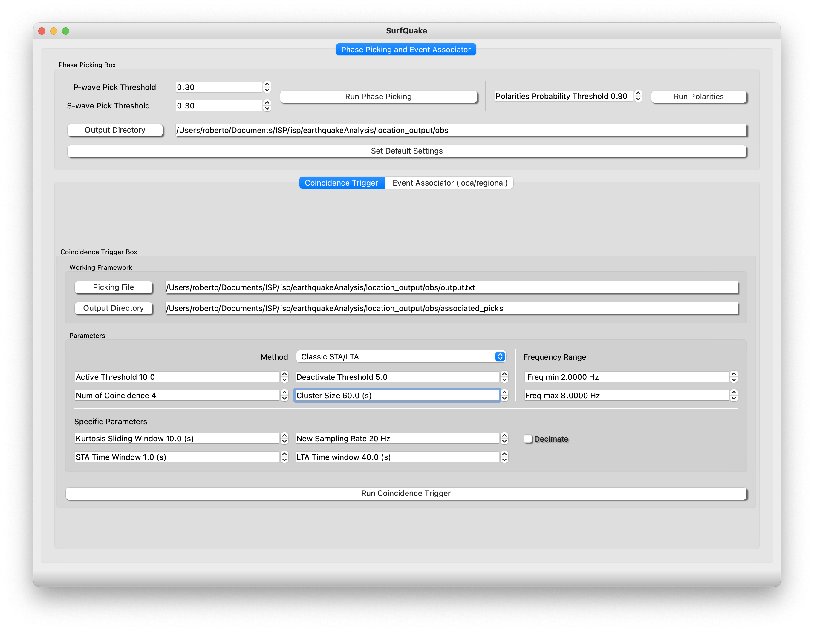
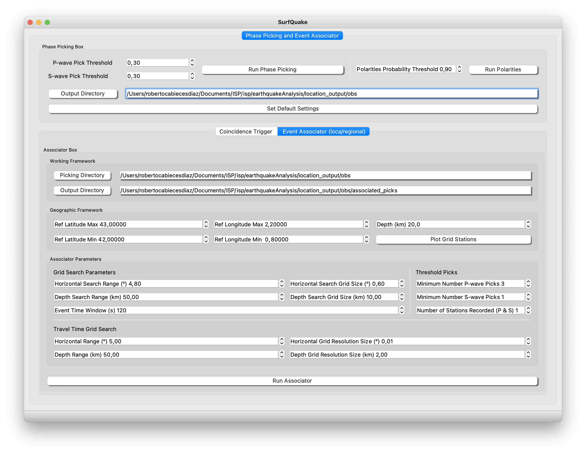

***

## Multimedia Material

### Seismogram Analysis

Updated

The following video shows summarize how to manage the basic waveform processing

<!-- blank line -->
<figure class="video_container">
  <video controls="true" allowfullscreen="true" poster="../img/poster_image.png" width="740" height="400">
    <source src="../img/basic_processing.mp4" type="video/mp4">
  </video>
</figure>
<!-- blank line -->

### Explore your Catalog

Updated

The following video shows a user loading a project, then explores the project using the fast decimation. In the second parte, the user opens a catalog, selects and event and send the information to the main window. Finally filters the project by time and process and plot to see the event wavefroms. 
Please go to Start with the **Basics --> Shorcuts --> Mouse**.

<!-- blank line -->
<figure class="video_container">
  <video controls="true" allowfullscreen="true" poster="../img/poster_image.png" width="740" height="400">
    <source src="../img/explore_catalog.mp4" type="video/mp4">
  </video>
</figure>
<!-- blank line -->

### Manual Pick, Locate Event, Fault Plane and Magnitude

Updated

The following video shows a user loading a project, then automatically picking phases plus polarity. 
Please go to Start with the **Basics --> Shorcuts --> Mouse**.

<!-- blank line -->
<figure class="video_container">
  <video controls="true" allowfullscreen="true" poster="../img/poster_image.png" width="740" height="400">
    <source src="../img/full_location.mp4" type="video/mp4">
  </video>
</figure>
<!-- blank line -->

### Automatic Picking and Associate

Updated

The following video shows a user loading a project, then automatically picking phases plus polarity. 
Please go to Start with the **Basics --> Shorcuts --> Mouse**.

<!-- blank line -->
<figure class="video_container">
  <video controls="true" allowfullscreen="true" poster="../img/poster_image.png" width="740" height="400">
    <source src="../img/picking_associate.mp4" type="video/mp4">
  </video>
</figure>
<!-- blank line -->

***

