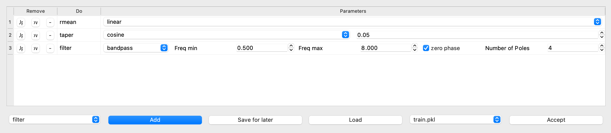
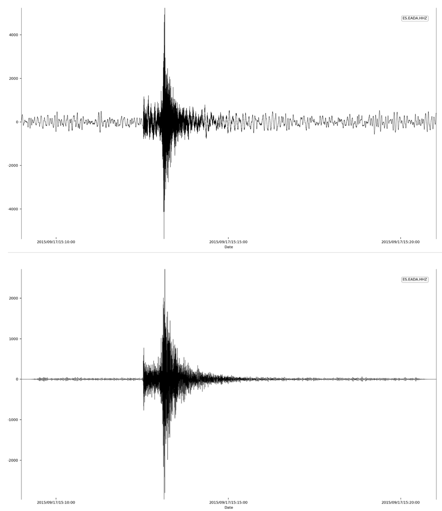
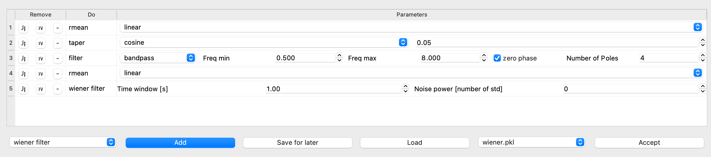
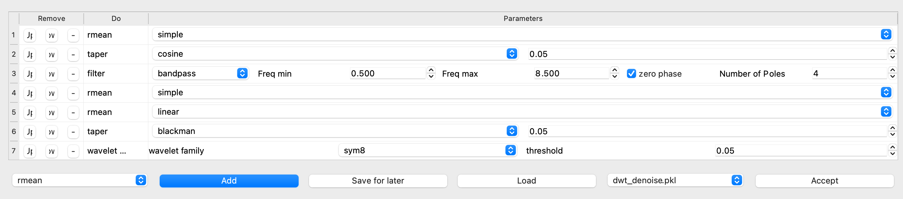
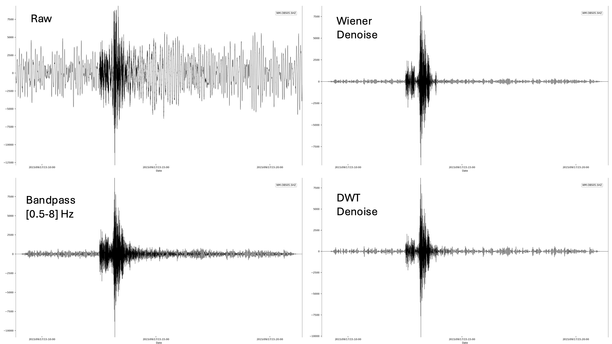
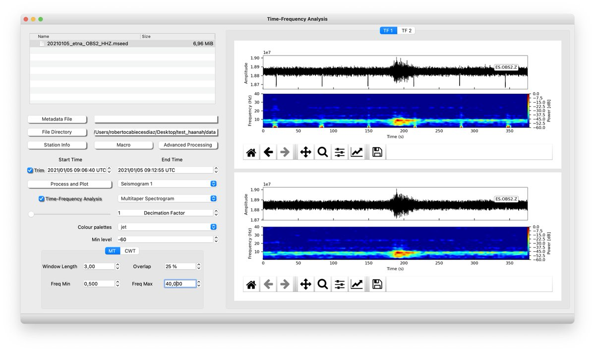

# ISP Macro Processing Pipeline

The **Macro** module in ISP allows users to apply a series of signal processing steps to seismic data using a flexible, GUI-driven interface. Macros are applied sequentially and can include filtering, denoising, normalization, and transformation operations. 
This macro system enables reproducible, streamlined signal processing for all ISP toolboxes. Adjust each block interactively and view the effect in real time.

This page describes the macro structure, available processing tools, and typical workflows with illustrative examples.

---

## Macro Structure

The macro tree defines each processing step in logical order. Each node represents a category or method with customizable parameters.

---

### Detrending Methods

**Remove mean / trend from the signal**

- `linear` — Remove a best-fit line
- `demean` — Subtract mean value
- `polynomial` — Fit and subtract a polynomial (e.g., order 3)
- `spline` — Remove a smooth spline trend

---

### Taper

**Applies a window function to reduce edge effects**

- **Parameter:** `max_percentage` (e.g., `0.05` = 5%)
- **Supported Windows:**
  - `cosine`, `barthann`, `bartlett`, `blackman`, `blackmanharris`
  - `bohman`, `boxcar`, `chebwin`, `flattop`, `gaussian`
  - `general_gaussian`, `hamming`, `hann`, `kaiser`, `nuttall`
  - `parzen`, `slepian`, `triang`

---

### Normalize

**Scales data globally**

- `0`: Normalize by maximum
- Any other value: Divides trace by specified value

---

### Filtering

**Band filter operations**

- **Parameters:** `freqmin`, `freqmax`, `zerophase`, `poles`
- **Methods:**
  - `bandpass`, `lowpass`, `highpass`, `bandstop`
  - `cheby1`, `cheby2`, `elliptic`, `bessel`

> `freqmin` must be less than `freqmax`.

---

### Wiener Filter

**1D Wiener de-noising**

- **Parameters:** `time_window` (sec), `noise_power`
- **Tip:** Use `1s` window; if `noise_power=0`, it's estimated from variance.

---

### Resample

**Adjust signal's sampling rate**

- **Parameters:** `new_sampling_rate`, `pre_filter` (recommended `True`)

---

### Fill Gaps

**Reconstruct missing data**

- **Methods:** `latest` or `interpolate`

---

### Differentiation

- **Methods:** `gradient`

---

### Integration

- **Methods:** `cumtrapz`, `spline`

---

### Time Shifting

**Shift traces by custom time offsets**

- **Parameter:** List of shifts (in seconds)

---

### Remove Instrument Response

- **Parameters:** pre-filter corners, `water_level` (60–90), `output` units

---

### Add White Noise

**Simulate noise at defined power**

- **Parameter:** Noise power in dB relative to signal max

---

### Spectral Whitening

**Flattens spectrum using a defined bandwidth**

- **Parameters:** `spectral_bandwidth`, `taper` (True/False)

---

### Time Normalization

**Normalize signal in time**

- **Parameters:** `time_window`, `method`
- **Methods:**
  - `time-normalization`, `1-bit`, `clipping` (with iterations)

---

### Wavelet Denoise

**Wavelet-based signal denoising**

- **Parameters:** `wavelet_family` (e.g., `sym8`), `threshold` (e.g., `0.05`)

---

### Smoothing

**Reduces high-frequency noise**

- **Parameters:** `time_window`, `fwhm`
- **Methods:** `mean`, `gaussian`, `tkeo`

---

### Spike Removal

**Remove outliers or spikes**

- **Parameters:** `time_window`, `threshold` (in std units)

---

## Filter Design Example

In this example, we use a regional earthquake trace expected to contain energy in the 0.5–8 Hz band. We:

1. Remove linear trend
2. Apply a cosine taper (5%)
3. Use a **bandpass filter** with:
   - `freqmin=0.5`
   - `freqmax=8`
   - `poles=4`
   - `zerophase=True`

The top panel shows the raw signal, and the bottom shows the filtered version:

---

## Signal Denoising Example

We now show how to denoise a noisy ocean-bottom seismometer trace using:

- **Wiener filter**
- **Wavelet denoising**

### Step 1: Wiener Filter

### Step 2: Wavelet Transform

### Final Output

---

## Removing Spikes Example

In this example we use the Hampel algorithm to remove the waveform spikes. In the image is shown the effect in the time domain and in the spectrogram after applying the "removing spikes" macro.

---