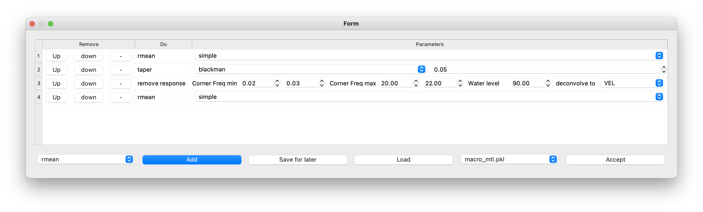
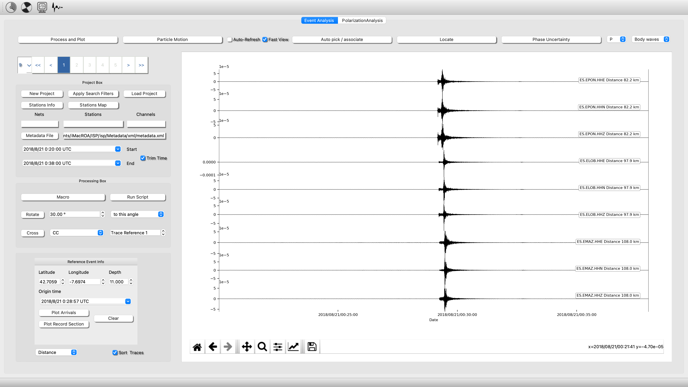
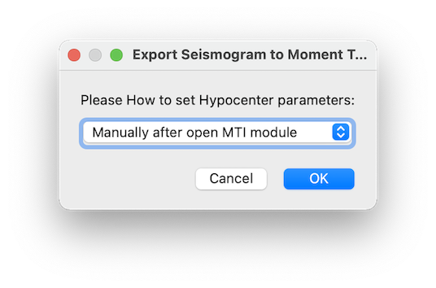
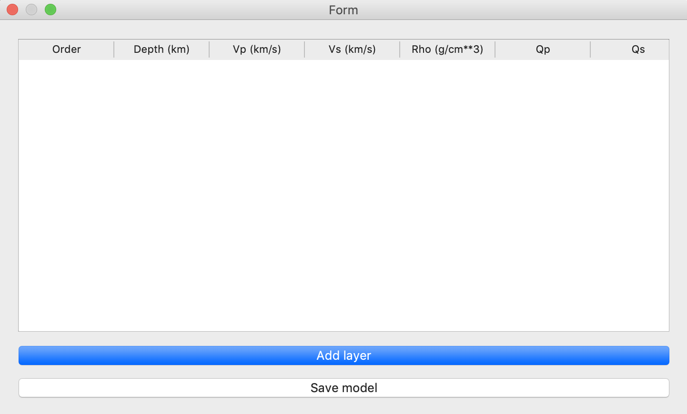
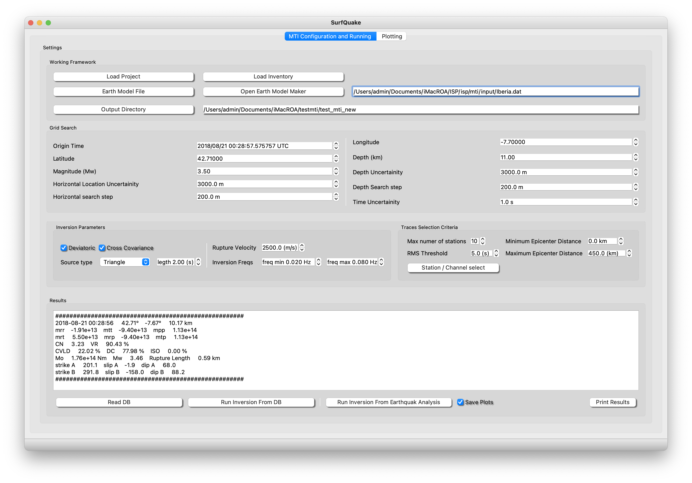
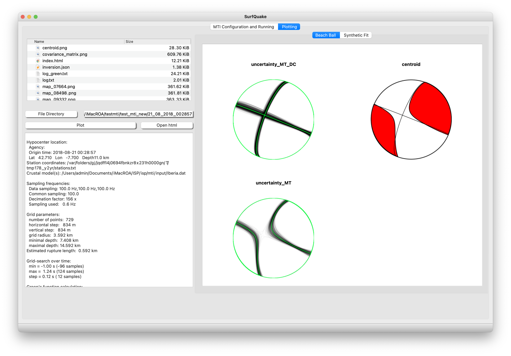

# Moment Tensor Inversion (MTI).

## Methodology
The functionality of this module is based on the Bayes-ISOLA code [Vackář et al., 2017](https://academic.oup.com/gji/article/210/2/693/3747443), a tool for automated CMT inversion in a Bayesian framework. A nice improvement that boost the robusness of the MTI is to use an optional data covariance matrix from pre-event noise that yields an automatic weighting function for the receiver components according to their noise levels. This also serves as an automated frequency filter that suppresses noisy frequency ranges. 

During the inversion, a grid search is performed over time and space, combined with an analytical (least squares) moment tensor inversion at each grid point, which accelerates the inversion process. The more time-consuming tasks like the Green’s function computation and the grid search are parallelized for efficiency. The results provided by the module contain the best-fit solution, as well as the full posterior probability density function (PPDF), which allows the user to plot the marginal probability density functions (PDFs) for any of the CMT parameters.
***

## Connect Earthquake Analysis to MTI module.

The first step to estimate the Focal Mechanism using the MTI module is to send your waveforms in velocity usints to the MTI module. To be familiarize with this process, you have an example inside 

<pre>
    <code>
Waveforms, macro and event info --> /isp/example/Moment_Tensor_example
Metadata --> /isp/Metadata/xml/metadata.xml
    </code>
</pre>

- Create a new project pointing to the files of the example
- Load the metadata
- Load Macro
- Process and plot your waveforms
- Cut the waveforms (remember with Q starttime and E endtime over the plot and check the box Trim Time), then Process and plot your waveforms another time.

See the figures related with this example

Click on Macro and Load the file **macro_mti.pkl** from the example:

Click on Process and Plot:

Now everything is ready!!!, We need to send all of this information (Waveforms plus metadata to MTI module).
Now, click on the picture (up left button) 

This action will connect your waveforms with the MTI module. It will open a dialog asking how to set your earthquake hypocenter source parameters (lat, lon, depth and mag).

You can either choose:

- Manually. After open MTI module, you will have to fill Moment Tensor Parameters box by yourself.
- Load Last Location, This action will load the information from your last (last.hyp file) eartuquake location from the default output location folder and will automatically fill the Moment Tensor.
- load other, This action will let you choose a "file.hyp" file and will automatically fill the Moment Tensor.

Ok, now we are almost ready, next is configurate your eath velocity model

## Create Earth velocity model

To start you need to load a Earth model. Go to Build a 1D Earth Model and open the Earth Model Form, the fill it and save it.

Alternatively, Yo can find examples of regional models in **./isp/mti/input/iberia.dat** and **./isp/mti/input/AK135.txt**.

***

## Bayesian Inversion

In this point the conexion between Earthquake Analysis and MTI module is done. You have in memory the Seismograms processed and the Metadata (information of stations coordinates and the response of the instrument). The connexion is not required, if you want to run the MTI from the database (see database for further details and below to see how to run it).

- Output Files >> path to the seismogram files

- Earth Model >> Path to the Earth model file (see previous section for see how to make this file with ISP, the user can also do it manually).

- Open Stations/Channels info. This action will allow you select which station/component will be used in the inversion (this is a mandatory action.

Now fill the Moment Tensor Information Box;

1. **Hipocenter Location and Uncertainty (m)**  
   Include the estimated hypocenter location along with its associated uncertainty in meters.

2. **Origin Time and Uncertainty**  
   Specify the calculated origin time of the event and its corresponding uncertainty.

3. **Magnitude**  
   Provide the event's magnitude as determined from the analysis.

4. **Frequency Range for Inversion**  
   Indicate the frequency range used during the inversion process. Refer to the example shown in the figure below for clarity.

5. **Distance Filter**  
   Exclude stations that fall outside the defined distance filter. This filter is based on the distance from the epicenter to each station.

6. **Options for Running the Inversion**  
   Depending on your analysis, you can choose from the following options:

        - Deviatoric  
         Configure the inversion to focus on deviatoric components.

        - Source Circular Shape  
         Enforce a circular source shape for the inversion process.

        - Covariance 
         Use covariance for the inversion.  
         *Note:* Covariance utilizes a previously calculated noise window. 
         Ensure that this window is sufficiently long (e.g., at least 15 minutes).

        - Precalculated Green Functions  
         Utilize precalculated Green functions to streamline the inversion process.  
         *Tip:* Run an initial inversion with this option disabled to generate the necessary Green functions.  
         Once generated, you can refine the inversion by selecting different components, distance filters, or frequency bandwidths.

## Plotting Your results

In order to plot your results,

- Click at Plot at last solution -- It will print a log file with the result of the inversion, and the beachball of the focal methanism plus the fit of the synthetci seismograms in time and frecuwency domain. Double click on the images to zoom in.

- Click at Open full report. It will be open the report with the full output images on your webbrowser navigator.

## Multimedia Material (MTI)

<!-- blank line -->
<figure class="video_container">
  <video controls="true" allowfullscreen="true" poster="../img/poster_image.png" width="740" height="400">
    <source src="../img/MTI.mp4" type="video/mp4">
  </video>
</figure>
<!-- blank line -->
