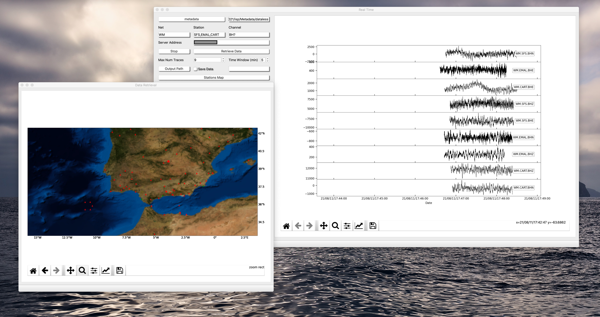

# Near Real Time Adquisition

The tool Near Real Time Adquisition is intended to retrieve data from a server.

## Structure

- **Metadata**

Set the metadata file

- **Net/Station/Channel

Place separated by "," the name of nets stations and channels you want to retrieve. It is convinient to use wildcards such as "BH?" or "*"

- **Server Address**

Set the name of the server address you want to point to.

- **Max Num Traces**

Number of traces you want to plot

- **Time Window**

Duration of the time window in minutes you want to plot the traces

- **Save Data**

This action will allow saving the mseed files that are collected in the destionation folder. The mseed will have a maximum of 24 h being the cut at "00:00:00.0000".

- **Plot Map**

This action will plot the map of the metadata stations in red plus the statios you are collecting data in green.