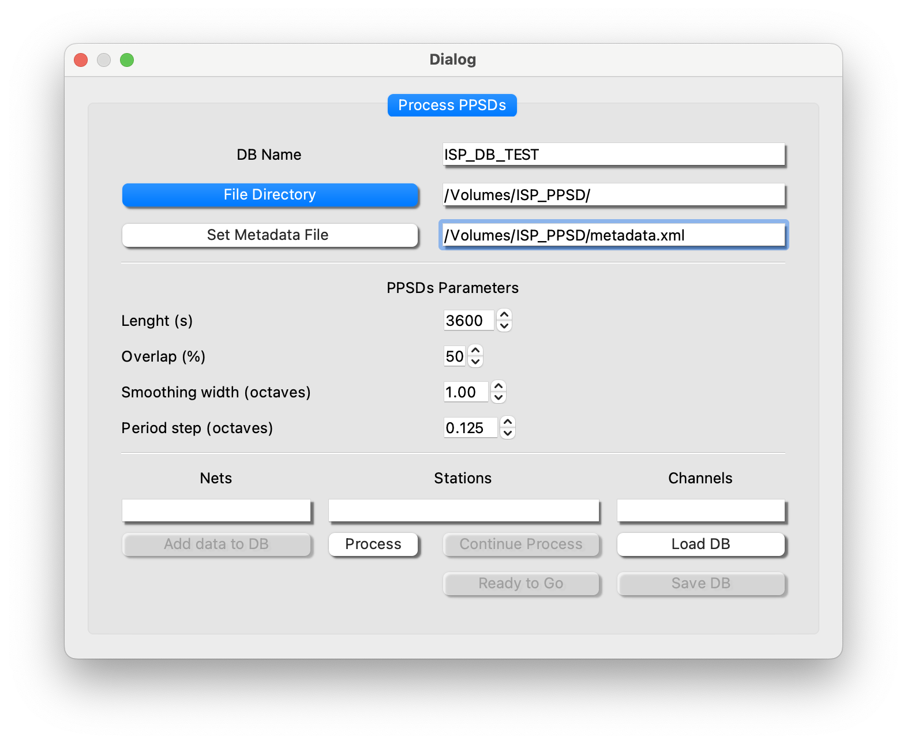
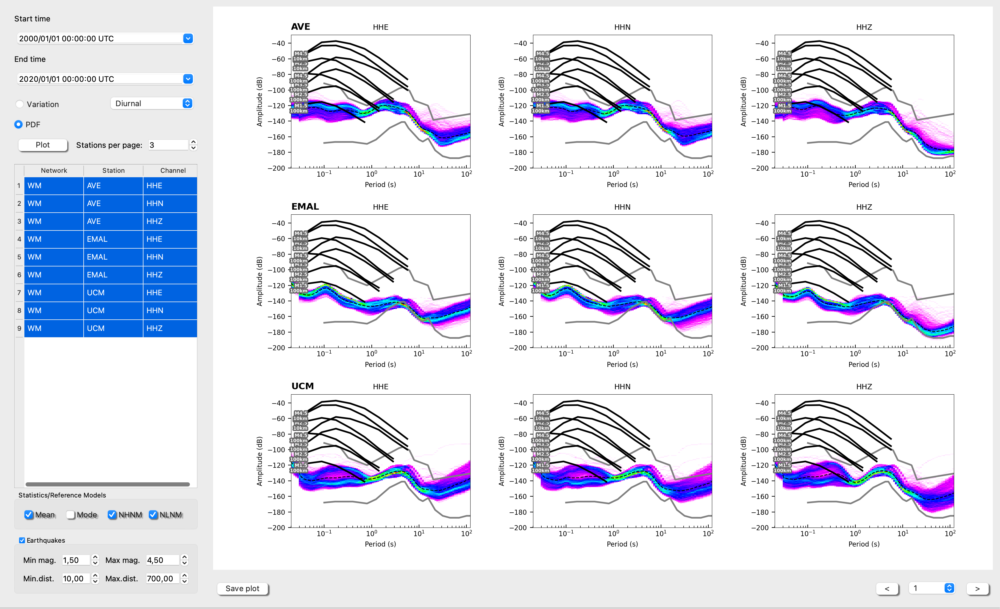
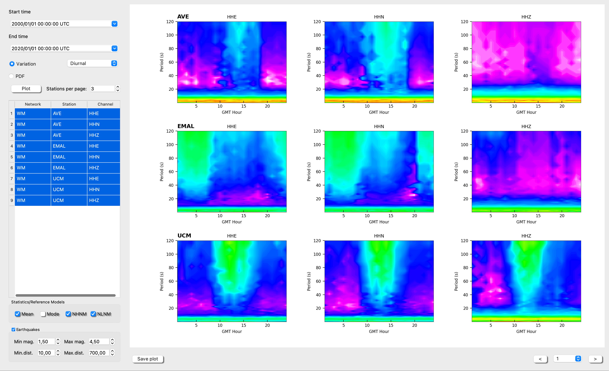
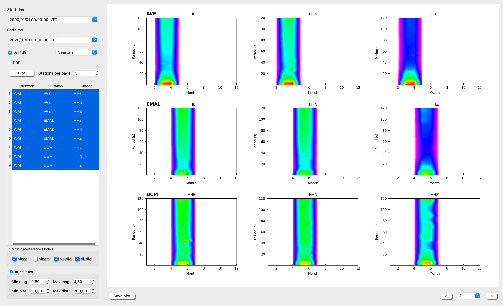

# Probability Power Spectral Dentitiy (PPSD)

## Background
One the most common tools to evaluate the station performance of seismic data acquisition (Mcnamara and Buland, 2004) is to estimate the Probability Density Functions (PDFs). Once the PDFs are calculated, the seismic noise levels can be compared with the standard low and high noise levels, NLNM and NHNM (Peterson, 1993), or can be calculated cumulative spectrograms to observe seasonal variations.

The ISP submodule “PPSD” allows to build a database to storage the PDFs of the stations/components desired from PPSDs, with an specific frame work for this task. Moreover the original databased can be upgraded with more data. Once the PDFs  are computed, they can be visualized into another framework that offers multiple visualization options. The Fig. 1 shows the visualization framework with the PDFs of three components from three different station and the Fig 2 & 3 the diurnal and seasonal variation, respectively. The PDFs are also compared with earthquake power desnsity spectrums (Clinton and Heaton, 2002).

## How to use this PPSD toolbox

The first step is to generate a database where all PDFs will be saved for later use. For this porpuse the user have available the following dialog.

- **Set how you want to name your new database**: and set the path where you have your folder tree, populated by seismograms and sel the metadata directory path.

- **Set the spectral parameters**:

Length – Length of data segments passed to psd in seconds. A lenght of 3600 s (1 hour) is recommended to balance the frequency resolution with the nu,ber of segments.

Overlap of segments passed to psd. Overlap may take values between 0 and 100 and is given as % of the length of one segment, e.g. ppsd_length=3600 and overlap=50 % result in an overlap of 1800s of the segments.

Smoothing width in octaves. Determines over what period/frequency range the psd is smoothed around every central period/frequency. Given in fractions of octaves (default of 1 means the psd is averaged over a full octave at each central frequency).

Period step octaves. Step length on frequency axis in fraction of octaves (default of 0.125 means one smoothed psd value on the frequency axis is measured every 1/8 of an octave).

- **Select filter**: per network, stations and channels. For example

Nets --> WM,ES

Stations --> SFS,EPON

Channels --> HHZ,HHE,HHN

If you keep empty spaces at the filter boxes the process will run over all sismograms at the folder tree specified above.

- **Click on Process**: At this step ISP will procss all seismograms and will create a database od PDFs. This process can take for a while specially if your folder tree has many seismogram files. Be patient, a progress bar will let you know.

- **Save the Database**: Save the PDFs database for later use. VERY RECOMENDABLE

- **Ready to Go**: This action will send all information (PDFs and station information) to the PPSSD main frame. A table with all available network/station/channel will be fill.

- **Select some raws from the table**: set the nu,ber of stations per page that you want to visualize and select the PDF or Variation (be careful with the time window you select, if you hesitate choose something crazy from year 1975- year 2060). 

- **Finally click on plote**: You can select the page at the bottom right part of the plot. *Warning*, if the colorpallette appears overlapped, just click another time at plot.

