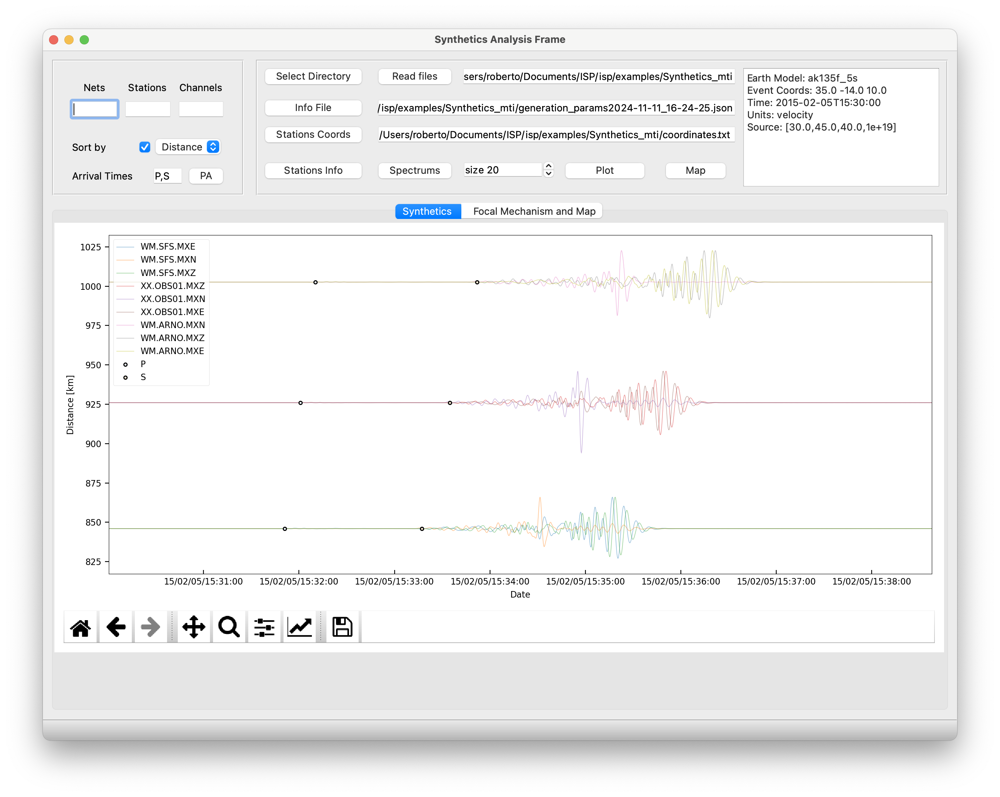
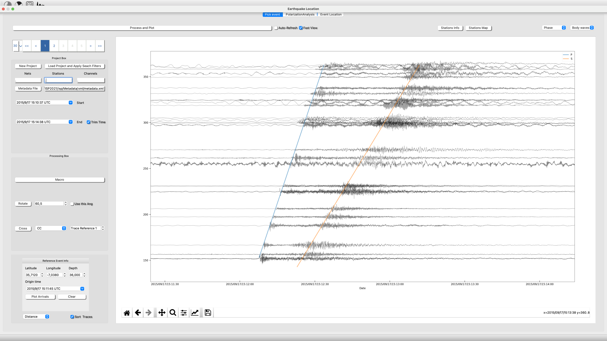
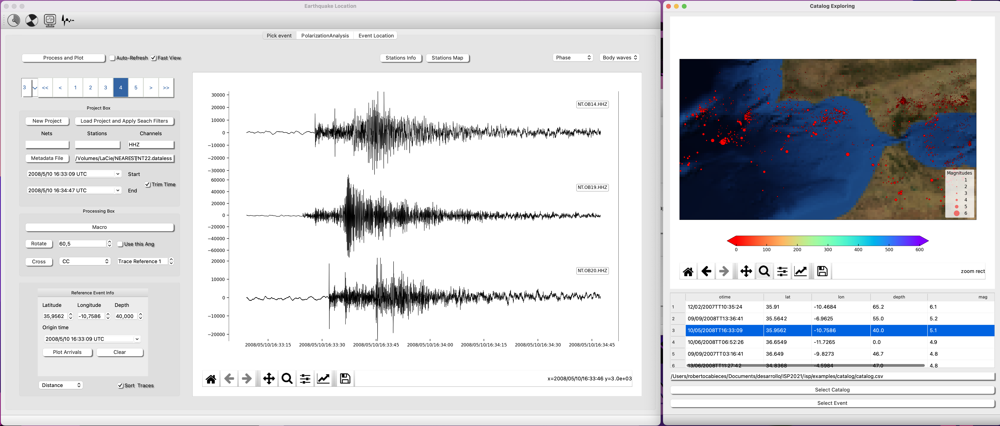

## News 22-Nov-2024

We have upgraded modules Moment Tensor Inversion and Array Analysis. Now they are perfectly connected with Earthquake analysis and are much more flexible and intuitive.

## News 1-Nov-2024

- We have renew the [Synthetic Toolbox](https://projectisp.github.io/ISP_tutorial.github.io/synth/).

- We have included an option to run your own Python script from a seismogram processed with ISP. You can see how to use this option at [Earthquake Seismology - Run Script ](https://projectisp.github.io/ISP_tutorial.github.io/el/).

- Now you can read ObsPy catalogs using ISP [Earthquake Seismology - Search in Catalog ](https://projectisp.github.io/ISP_tutorial.github.io/el/).

The ISP team has recently developed:

- Earthquake Analysis module Upgraded

In this upgrade you can create your project from your individual files or from your sds structure. We have also included a fast way to search your waveforms from a catalog (./isp/examples/catalog/). 

Now it is created a connection Earthquake Analysis to TF Analysis to allow the user a rapid deep signal processing investigation.

Moreover, it is included a very nice way of sort tyour waveforms by distance and showing the theoretical Travel-Times.

- Seismic Ambient Noise Tomography 

For now, It is available the Empirical Green Functions retrieval of vertical and Horizontal components, synchronize clocks using EGFs ,a tool to measure Group and Phase velocity from dispersion curves and create dispersion maps.

An example with the results of Cabieces et al., 2022 "Upper lithospheric structure of northeastern Venezuela from joint inversion of surface wave dispersion and receiver functions" can be found in ./isp/ant

We have implemented the conexion between Erthquake Location and [**Time-Frequency Anlysis**](https://projectisp.github.io/ISP_tutorial.github.io/tf/#connect-with-earthquake-analysis)