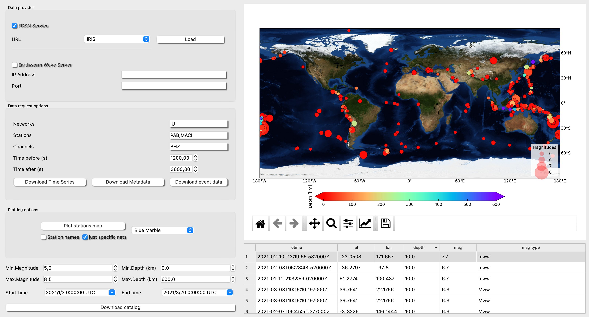

# Retrieve Data

Retrieve Data framework is an interface to facilitate download specific events to time-series or select a period and download data from different stations.

***

**Step 1, FDSN connection**: 

Select a FDSN web service and click **Load**. This action will load the inventory. 
**Warning**, some FDSNs service have access to more than one network, so if you want to speed up the process please select anetwork (see figure is preselected network IU.

**Step 2, Download Catalog**:

Once the FDSN connection is done, fill the fileds in Catalog box and then click **Download catalog**. Warning, please if you are too ambicious (e.g., a catalog of many years) the procees can be endless :-).
The events will be plot according to the magnitude and scale bar depth (km).

Select an event pressing "t" near an epicenter (this is to graphycally help the user select events). You will see the event selected iluminated in grey in the events table. Now click on the iluminated row to be definetly selected (now the sleected row will be shown in blue). You can select more than one vent to be downloaded at once!!!

**Step 3, Selection Process**:

Plot Stations: This action will plot the stations inside the inventory from your FDSN connection (step 1).

Station Selction: Doucle-click near the red triangles to automatically include names inside Network/Stations box. Press "c" near the psotion of the station you want to remove from the selection (might be you want to deselect some stations). Manually just station names separated by commas e.g. ARNO,SFS (see figure). 

Select Components: Examples: BH? or simply BHZ (accept wildcards) or BHN,BHE,BHZ.

**Step 4, Download Data**:

From this point you can follow different actions,

Download Time Series: Just set Starttime and Endtime and click on the button. This will download the mseeds of the stations/channels requested for that period.

Download Metadata: This action will download the stations.xml of the stations/channels requested. This file is the metadata that is used by ISP in the rest of the modules.

Download event data: This action will download the events selected data of the list of Newtork/Stations/Channels with a time window lenght Time before - otime- Time after. Warning: Be sure you have clicked in the events table just in the events you want to donwload data.

Finally ISP will request a folder where you want to download the data. A feedback with downloading process will be shown.

The available FDSN web services are:

- BGR         http://eida.bgr.de
- EMSC        http://www.seismicportal.eu
- ETH         http://eida.ethz.ch
- GEONET      http://service.geonet.org.nz
- GFZ         http://geofon.gfz-potsdam.de
- ICGC        http://ws.icgc.cat
- INGV        http://webservices.ingv.it
- IPGP        http://ws.ipgp.fr
- IRIS        http://service.iris.edu
- ISC         http://isc-mirror.iris.washington.edu
- KNMI        http://rdsa.knmi.nl
- KOERI       http://eida.koeri.boun.edu.tr
- LMU         http://erde.geophysik.uni-muenchen.de
- NCEDC       http://service.ncedc.org
- NIEP        http://eida-sc3.infp.ro
- NOA         http://eida.gein.noa.gr
- ODC         http://www.orfeus-eu.org
- ORFEUS      http://www.orfeus-eu.org
- RASPISHAKE  http://fdsnws.raspberryshakedata.com
- RESIF       http://ws.resif.fr
- SCEDC       http://service.scedc.caltech.edu
- TEXNET      http://rtserve.beg.utexas.edu
- USGS        http://earthquake.usgs.gov
- USP         http://sismo.iag.usp.br

There is also the possibility to connect to your own Earthworm server to download the inventory and the data. Just fill the check box and the IP/Port.

We are working in the connection between SeisComp3 Database and ISP. We will soon deliver this part of the project (currently is being tested).
