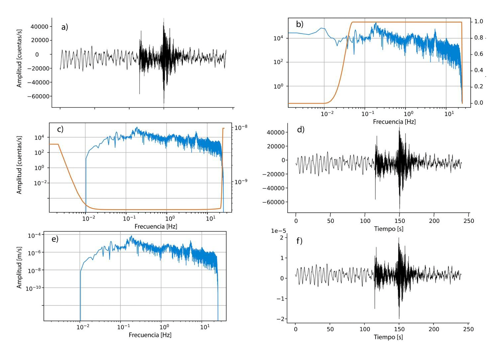

# Removing Instrumental Response in Seismology

In seismology, raw seismic data is recorded in **instrument-specific units** such as volts or counts. To make this data physically meaningful (e.g., velocity in m/s or acceleration in m/s²), it is necessary to **remove the instrument response**. This process transforms the data from **instrumental domain** to **physical units**.

This is crucial for:
- Comparing data from different stations or networks
- Performing quantitative analyses like magnitude estimation or spectral modeling
- Ensuring reproducibility and consistency in scientific studies

---

## What Is an Instrument Response?

Each seismic instrument has a unique transfer function that describes how ground motion is converted into recorded data. This includes:
- **Poles and zeros** (complex filter characteristics)
- **Gain** (amplification factor)
- **Sensitivity** (response to input motion)

The instrument response can be described as a linear system:
$$
X(s) = G \cdot H(s) \cdot U(s)
$$
Where:
- \( X(s) \): recorded signal in the Laplace domain
- \( G \): gain factor
- \( H(s) \): instrument transfer function (defined by poles and zeros)
- \( U(s) \): true ground motion

Removing the response means solving for \( U(s) \).

---

## General Workflow

1. **Retrieve Instrument Metadata**
   - From a datacenter (e.g., IRIS, EIDA) via FDSN or local RESP/PAZ files

2. **Apply Detrending and Tapering**
   - Prepares data for deconvolution by avoiding edge effects

3. **Deconvolve Instrument Response**
   - Removes instrument effect from signal using poles, zeros, and gain

4. **Output in Desired Unit**
   - Displacement, velocity, or acceleration

The figure shows the instrumental response suppression process of a seismogram. a) Seismogram, b) amplitude spectrum of the seismogram (blue line) and amplitude spectrum of the filter (orange line), c) amplitude spectrum of the filtered seismogram and inverse of the amplitude spectrum of the instrument response, d) filtered seismogram, e) amplitude spectrum of the velocity seismogram (blue line), f) velocity seismogram.



---

## Example Using ObsPy

```python
from obspy import read, read_inventory

# Load seismic trace
tr = read("seismic_data.mseed")[0]
fs = tr.stats.sampling_rate
# Load instrument response metadata
inv = read_inventory("RESP_file_or_stationxml.xml")

# Remove instrument response
tr.remove_response(inventory=inv, output="VEL", pre_filt=(0.005, 0.008, fs/3, fs/4),
                   water_level=90, taper=True, plot=True)
```

**Parameters Explained:**
- `output`: Desired physical unit ("DISP", "VEL", "ACC")
- `pre_filt`: Frequency band to preserve (prevents amplification of noise)
- `water_level`: Stabilizes deconvolution
- `plot`: Visualizes the process for verification

---

## Best Practices

- Always inspect metadata (make sure it's correct for your station/time).
- Use **pre-filtering** to prevent noise amplification.
- Apply **tapering** before response removal to avoid ringing.
- Choose **output units** based on your analysis goals.

---

## Summary Table

| Step                     | Purpose                              |
|--------------------------|--------------------------------------|
| Retrieve Metadata        | Get poles, zeros, gain               |
| Detrend & Taper          | Prepare for stable deconvolution     |
| Remove Response          | Get ground motion in physical units  |
| Validate & Plot          | Confirm results visually             |

---

This step is essential for turning raw seismic signals into scientifically usable ground motion measurements. In `ISP`, this operation is available with simple parameters via wrappers around ObsPy's robust response-removal functionality.
