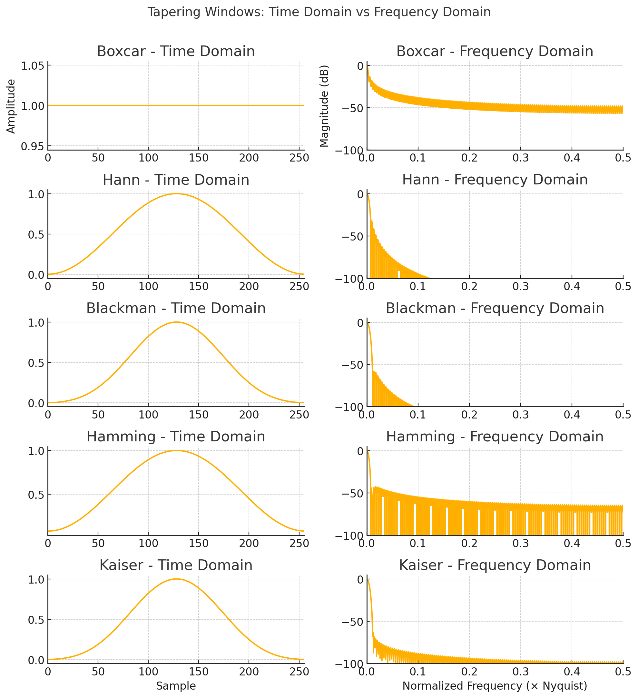
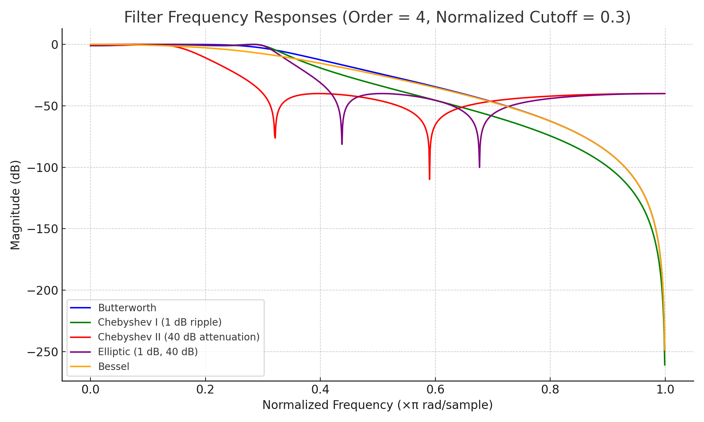
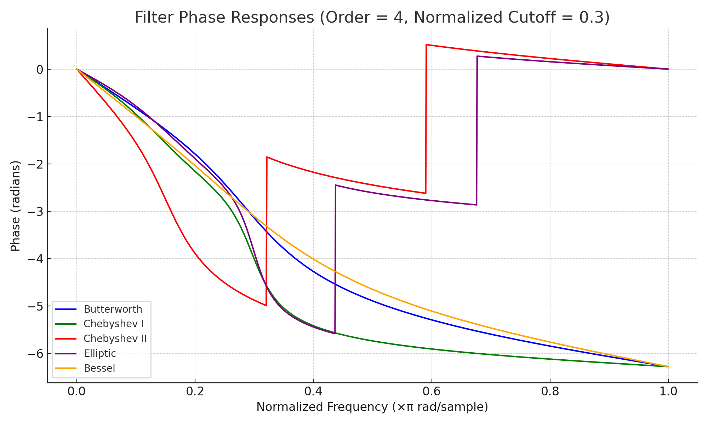

# Detrending methods
In ISP, detrending is an essential preprocessing step for signal analysis. Detrending removes slowly varying components (trends) that are not related to the signal of interest. Below is a concise explanation of each method, along with relevant mathematical formulations where applicable. These methods remove trends (constant, linear, or curved) that can obscure the true characteristics of a seismic signal. Below is an overview of the implemented detrending methods and the underlying signal processing principles.

---

## `simple(data)`

**Description**:  
Removes a linear trend defined only by the first and last points of the data.

**Equation:**  
$$
\text{trend}(n) = x_1 + \left( \frac{x_2 - x_1}{N - 1} \right) \cdot n
$$

Where:
- \( x_1 \), \( x_2 \): first and last data points  
- \( n \): sample index  
- \( N \): length of the data

**Use Case**:  
Fast and minimal method for removing linear drift when higher-order curvature is not present.

---

## `polynomial(data, order)`

**Description**:  
Fits and subtracts a polynomial trend of specified order using least squares.

**Equation:**  
$$
\text{trend}(n) = a_0 + a_1 \cdot n + a_2 \cdot n^2 + \dots + a_k \cdot n^k
$$

Where:
- \( k \) = order  
- \( a_0, \ldots, a_k \): coefficients determined by polynomial fitting

**Use Case**:  
Useful when the signal exhibits smooth, curved trends (e.g., from instrument tilt or environmental changes).

---

## `spline(data, order, dspline)`

**Description**:  
Fits and subtracts a **smoothing spline**, a piecewise polynomial function defined over knots spaced by `dspline` samples.

**Mathematical Concept:**  
Minimizes the squared error between the signal and a smooth spline curve:

$$
\min \sum_{n} \left( x[n] - s(n) \right)^2
$$

Subject to continuity and smoothness of the spline \( s(n) \).

**Use Case**:  
Ideal for signals with smooth but irregular trends that are not well-represented by a single polynomial.

---

## Additional Built-in Methods

#### `'linear'`
Removes a least-squares linear trend using `scipy.signal.detrend`.

**Use Case**:  
General-purpose linear detrending.

---

#### `'constant'` or `'demean'`
Removes the mean of the signal (i.e., DC offset):

Constant. Removes the mean value from the data.

**Equation:**  
$$
x_d[n] = x[n] - \mu, \quad \text{where } \mu = \frac{1}{N} \sum_{n=0}^{N-1} x[n]
$$

Linear Detrending. Removes the best-fitting line using least squares.

**Equation:**  
$$
x_d[n] = x[n] - (a \cdot n + b)
$$

Where:
- \( a \) and \( b \) are coefficients of the least-squares linear fit to the data.

When breakpoints (`bp`) are specified, this fit is performed **piecewise** between break indices.

**Use Case:**  
Quick removal of linear trends or offsets.

---

## Summary Table

| Method        | Trend Type Removed        | Equation / Model                        | Use Case                            |
|---------------|---------------------------|------------------------------------------|-------------------------------------|
| `simple`      | Linear (endpoints only)   | Line from first to last point            | Fast, minimal drift                 |
| `polynomial`  | Polynomial (any order)    | polynomial trend of specified order                   | Curved baseline trends              |
| `spline`      | Smooth, adaptive trend    | Piecewise polynomial spline              | Irregular, smooth variations        |

| Type       | Description                 | Polynomial Degree | Equation                                |
|------------|-----------------------------|-------------------|-----------------------------------------|
| `constant` | Removes mean                | 0                 | \( x[n] - \mu \)                               |
| `linear`   | Removes linear trend        | 1                 | \( x[n] - (a \cdot n + b) \)                     |

---

These detrending tools in `ISP` help isolate meaningful signal components by removing artifacts caused by sensor drift, baseline offsets, or environmental conditions—crucial steps before spectral analysis, filtering, or triggering algorithms in seismic workflows.

# Signal Tapering Methods

## Introduction

Tapering is a critical preprocessing step in signal processing used to **smooth the edges of a signal** to minimize spectral leakage when performing operations like the Fast Fourier Transform (FFT). Applying a taper (or window function) reduces abrupt transitions at the signal boundaries, which can cause high-frequency artifacts and distort the frequency representation.

Tapering is typically applied by multiplying the signal with a window function \( w[n] \), which modifies the signal near the beginning and end without significantly affecting its core content. These windows can be applied directly using the tapering methods built into the ISP pipeline. Choose a window based on your analysis goals (e.g., frequency resolution vs. leakage suppression).

**Equation for tapered signal:**  
$$
x_\text{tapered}[n] = x[n] \cdot w[n]
$$

---

## Supported Tapering Methods and Their Equations

### 1. `cosine`
**Equation:**  
$$
w[n] = \sin\left( \frac{\pi n}{N} \right), \quad 0 \leq n \leq N
$$

---

### 2. `barthann` (Modified Bartlett-Hann Window)
**Equation:**  
$$
w[n] = 0.62 - 0.48 \left| \frac{n}{N} - 0.5 \right| + 0.38 \cos\left( 2\pi\left( \frac{n}{N} - 0.5 \right) \right)
$$

---

### 3. `bartlett` (Triangular Window)
**Equation:**  
$$
w[n] = \frac{2}{N - 1} \cdot \left( \frac{N - 1}{2} - \left| n - \frac{N - 1}{2} \right| \right)
$$

---

### 4. `blackman`
**Equation:**  
$$
w[n] = 0.42 - 0.5 \cos\left( \frac{2\pi n}{N - 1} \right) + 0.08 \cos\left( \frac{4\pi n}{N - 1} \right)
$$

---

### 5. `blackmanharris`
**Equation:**  
$$
w[n] = 0.35875 - 0.48829 \cos\left( \frac{2\pi n}{N - 1} \right) + 0.14128 \cos\left( \frac{4\pi n}{N - 1} \right) - 0.01168 \cos\left( \frac{6\pi n}{N - 1} \right)
$$

---

### 6. `bohman`
**Equation:**  
$$
w[n] = (1 - |x|) \cos(\pi x) + \frac{1}{\pi} \sin(\pi |x|), \quad x = \frac{2n}{N - 1} - 1
$$

---

### 7. `boxcar` (Rectangular Window)
**Equation:**  
$$
w[n] = 1
$$

---

### 9. `flattop`
**Equation:**  
$$
w[n] = 1 - 1.93 \cos\left( \frac{2\pi n}{N} \right) + 1.29 \cos\left( \frac{4\pi n}{N} \right) - 0.388 \cos\left( \frac{6\pi n}{N} \right) + 0.0322 \cos\left( \frac{8\pi n}{N} \right)
$$

---

### 10. `gaussian`
**Equation:**  
$$
w[n] = \exp\left( -0.5 \cdot \left( \frac{n - \mu}{\sigma} \right)^2 \right), \quad \mu = \frac{N - 1}{2}
$$

---

### 11. `general_gaussian`
**Equation:**  
$$
w[n] = \exp\left( -0.5 \cdot \left| \frac{n - \mu}{\sigma} \right|^{2p} \right)
$$

---

### 12. `hamming`
**Equation:**  
$$
w[n] = 0.54 - 0.46 \cos\left( \frac{2\pi n}{N - 1} \right)
$$

---

### 13. `hann`
**Equation:**  
$$
w[n] = 0.5 \cdot \left( 1 - \cos\left( \frac{2\pi n}{N - 1} \right) \right)
$$

---

### 14. `kaiser`
**Equation:**  
$$
w[n] = \frac{I_0\left( \beta \sqrt{1 - \left( \frac{2n}{N - 1} - 1 \right)^2 } \right)}{I_0(\beta)}
$$

Where \( I_0 \) is the modified Bessel function of the first kind.

---

### 15. `nuttall`
**Equation:**  
$$
w[n] = a_0 - a_1 \cos\left( \frac{2\pi n}{N - 1} \right) + a_2 \cos\left( \frac{4\pi n}{N - 1} \right) - a_3 \cos\left( \frac{6\pi n}{N - 1} \right)
$$

Standard coefficients:  
- \( a_0 = 0.355768 \)  
- \( a_1 = 0.487396 \)  
- \( a_2 = 0.144232 \)  
- \( a_3 = 0.012604 \)

---

### 18. `triang`
**Equation:**  
$$
w[n] = 1 - \left| \frac{n - \frac{N - 1}{2}}{\frac{N + 1}{2}} \right|
$$

---

## Summary

| Window        | Key Feature                     | Closed-Form Equation Available |
|---------------|----------------------------------|-------------------------------|
| cosine        | Smooth sinusoidal taper         | ✅                            |
| barthann      | Smooth hybrid window            | ✅                            |
| bartlett      | Triangular                      | ✅                            |
| blackman      | 3-term cosine                   | ✅                            |
| blackmanharris| 4-term cosine                   | ✅                            |
| bohman        | Sinusoidal with decay           | ✅                            |
| boxcar        | No taper                        | ✅                            |
| chebwin       | Optimized sidelobes             | ❌                            |
| flattop       | Accurate amplitude FFT          | ✅                            |
| gaussian      | Bell-shaped                     | ✅                            |
| general_gaussian| Adjustable shape              | ✅                            |
| hamming       | Low sidelobes                   | ✅                            |
| hann          | Raised cosine                   | ✅                            |
| kaiser        | Adjustable β parameter          | ✅                            |
| nuttall       | Smooth, low leakage             | ✅                            |
| parzen        | Smoothed triangular             | ❌                            |
| slepian       | Optimal energy concentration    | ❌                            |
| triang        | Linear rise/fall                | ✅                            |

---

# Signal Filtering

## Introduction

Filtering is a foundational operation in signal processing used to isolate or suppress specific frequency components of a signal. In **seismic and geophysical analysis**, filtering helps remove noise, enhance events of interest, and prepare data for further processing like spectral analysis or event detection.

Filters can be **lowpass**, **highpass**, **bandpass**, or **bandstop**, depending on the range of frequencies they preserve. Each filter type can be designed using various mathematical formulations, such as **Butterworth**, **Chebyshev**, **Elliptic**, and **Bessel** filters, each offering trade-offs in performance and characteristics like sharpness, ripple, or phase response.

---

## Key Concepts in Filtering

- **Filter Order (or Number of Poles):** Higher order = sharper cutoff, but more phase distortion and computational cost.
- **Zero-Phase Filtering:** Applies filter forward and backward, canceling out phase shifts (e.g., `scipy.signal.filtfilt`).
- **Causal vs. Non-Causal Filters:** Real-time systems require causal filters; post-processing can use non-causal zero-phase filters.

---

## Supported Filter Types in ISP

### 1. `bandpass` (Butterworth Bandpass)

**Description:**  
Preserves a frequency band between `f_low` and `f_high`.

**Transfer Function:**  
$$
|H(j\omega)|^2 = \frac{1}{1 + \frac{(\omega^2 - \omega_0^2)^2}{B^2 \omega^2}}
$$  
Where:
- \( \omega_0 \) = center frequency  
- \( B \) = bandwidth

---

### 2. `bandstop` (Butterworth Bandstop)

**Description:**  
Suppresses a frequency band, passing frequencies outside of `f_low` and `f_high`.

**Transfer Function:**  
Same form as bandpass, but with the attenuation focused within the band instead of outside it.

---

### 3. `lowpass` (Butterworth Lowpass)

**Description:**  
Allows frequencies below `freqmax` to pass; attenuates higher frequencies.

**Magnitude Response:**  
$$
|H(j\omega)| = \frac{1}{\sqrt{1 + \left(\frac{\omega}{\omega_c}\right)^{2n}}}
$$

Where:
- \( \omega_c \): cutoff frequency  
- \( n \): filter order

---

### 4. `highpass` (Butterworth Highpass)

**Description:**  
Allows frequencies above `freqmin` to pass; attenuates lower frequencies.

**Magnitude Response:**  
$$
|H(j\omega)| = \frac{1}{\sqrt{1 + \left(\frac{\omega_c}{\omega}\right)^{2n}}}
$$

---

## Advanced Filter Types

### 5. `chebychev` (Type I & II)

#### Type I

**Description:**  
Allows ripple in the passband but gives a sharper cutoff than Butterworth.

**Magnitude Response:**  
$$
|H(j\omega)|^2 = \frac{1}{1 + \epsilon^2 T_n^2\left(\frac{\omega}{\omega_c}\right)}
$$  
Where:
- \( \epsilon \): ripple factor  
- \( T_n \): Chebyshev polynomial of order \( n \)

#### Type II

**Description:**  
Allows ripple in the **stopband** instead of the passband.

**Notes:**  
Same cutoff sharpness advantages but a different ripple behavior.

---

### 6. `elliptic` (Cauer Filter)

**Description:**  
Most selective filter for a given order; ripple in both passband and stopband.

**Magnitude Response:**  
$$
|H(j\omega)|^2 = \frac{1}{1 + \epsilon^2 R_n^2(\xi)}
$$  
Where \( R_n \) is an elliptic rational function.

**Pros:** Very sharp transition.  
**Cons:** Ripple in both passband and stopband.

### 7. `bessel` (Maximally Flat Group Delay)
**Description:** Preserves waveform shape in time domain due to nearly linear phase response.

**Key Use Case:** When time-domain waveform fidelity is critical.

**Equation:**  
Based on Bessel polynomials; no sharp frequency cutoff

**Trade-Off:** Smooth transition but poor selectivity

---

## Summary Table

| Filter      | Passes              | Ripple       | Phase Response     | Steepness       |
|-------------|---------------------|--------------|--------------------|------------------|
| bandpass    | `f_low` to `f_high` | None         | Depends on method  | Moderate         |
| bandstop    | Outside band        | None         | Depends on method  | Moderate         |
| lowpass     | < `freqmax`         | None         | Depends on method  | Moderate         |
| highpass    | > `freqmin`         | None         | Depends on method  | Moderate         |
| chebychev I | Configurable        | In passband  | Non-linear         | High             |
| chebychev II| Configurable        | In stopband  | Non-linear         | High             |
| elliptic    | Sharpest            | Both bands   | Non-linear         | Very High        |
| bessel      | Wideband            | None         | Linear (best)      | Low              |

---

## Notes on Filtering Parameters

- **Order / Corners**: Higher values give sharper cutoffs but may distort phase unless using `zerophase=True`.
- **Zerophase Filtering**: Recommended for post-processing; avoids phase distortion by applying filter forward and backward.
- **Ripple (Chebyshev, Elliptic)**: Controls allowed deviation from flatness in pass/stop bands.

---

These filters are available in `ISP` via simple parameter settings and are based on robust implementations in `obspy` and `scipy.signal`.

## Filters response Comparison

This diagram shows how different filter types (Butterworth, Chebyshev I & II, Elliptic, Bessel) behave with a lowpass configuration at order 4 and a normalized cutoff frequency of 0.3.

This plot illustrates how different filters introduce phase shifts across frequencies. Notably:

- **Bessel**: has the most linear phase (preserves waveform shape).

- **Elliptic and Chebyshev filters**: exhibit significant phase distortion.

- **Butterworth**: shows moderate phase non-linearity.

