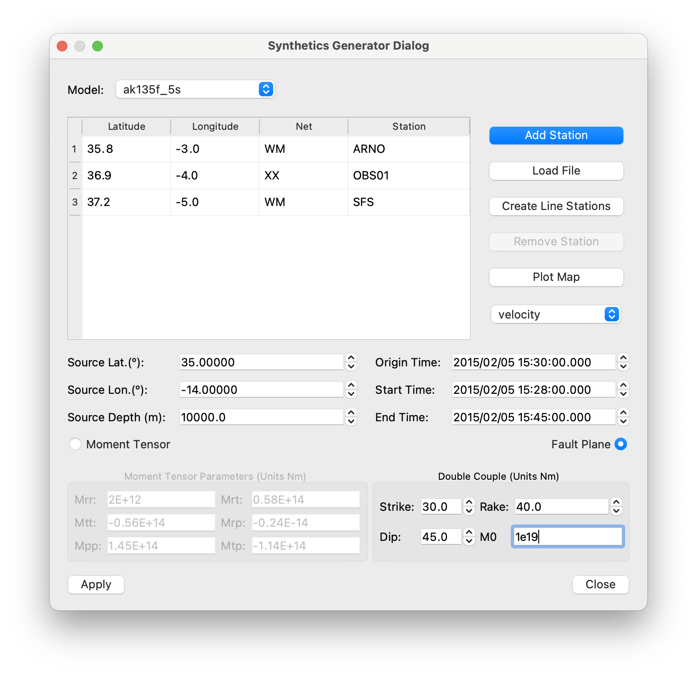
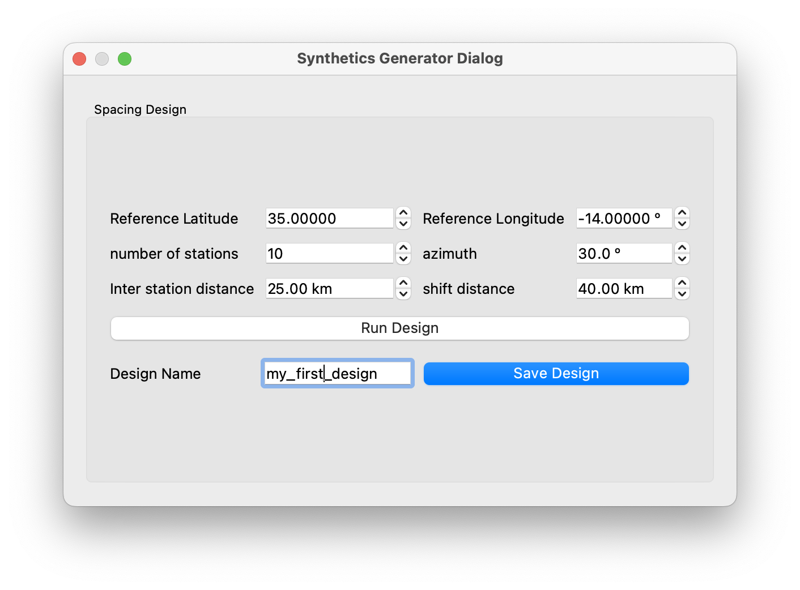

# Synthetic Generator

The synthetic toolbox is a toolbox designed to request synthetic seismograms from IRIS Synthetics Engine (Syngine).

To make a query just add the location of the stations for the synthetics be generated. In this step the user has two options.

- Add coordinates plus station name and network manually
- Load a coordinates files with the following structure

<pre>
    <code>
Latitude;Longitude;Network;Station
35.8;-3.0;WM;ARNO
36.9;-4.0;XX;OBS01
37.2;-5.0;WM;SFS
    </code>
</pre>

- Design a line with a number of stations from a specific geografic reference point. Just fill the following dialog:

Then choose a model, units (velocity, displacement or acceleration) the source coordinates and time spam and, very important, the type of source and focal parameters. Click at apply button and then the query will be send. Finally ISP will ask for a folder where will be save the seismograms in mseed format, the information related with the query in a file.json and the coordinates of the stations.

Finally, you can rapidly visualize the seismograms just following the example below. you will find the data at ISP/isp/example/Synthetic_mti to replicate the example.

From left to right.

- **Filter your seismogram selection**: by Nets, Station or channel. For example Nets WM, Stations OBS01 Channels OBS01 then pres Read Files to filter the seismogram selection to be shown.

- **PA button**: take the phases from the Attival Times and plot the theoretical values on the screen.

- **Stations Info**: will show basic information of the seismograms such as number of point, sampling rate, start time and end time. 
Spectrum will process and plot the amplitude spectrum of the seismograms.

- **Size**: is simply the amplification factor to visualize the seimograms.

- **Plot button**: will plot the seismograms (after applied selection filter using read files and the boxes Netwrok, station and channels). Try it!

- **Map**: will show the beach ball repreentimg the focal mechanism and the map with the epicenter and the stations distribution

