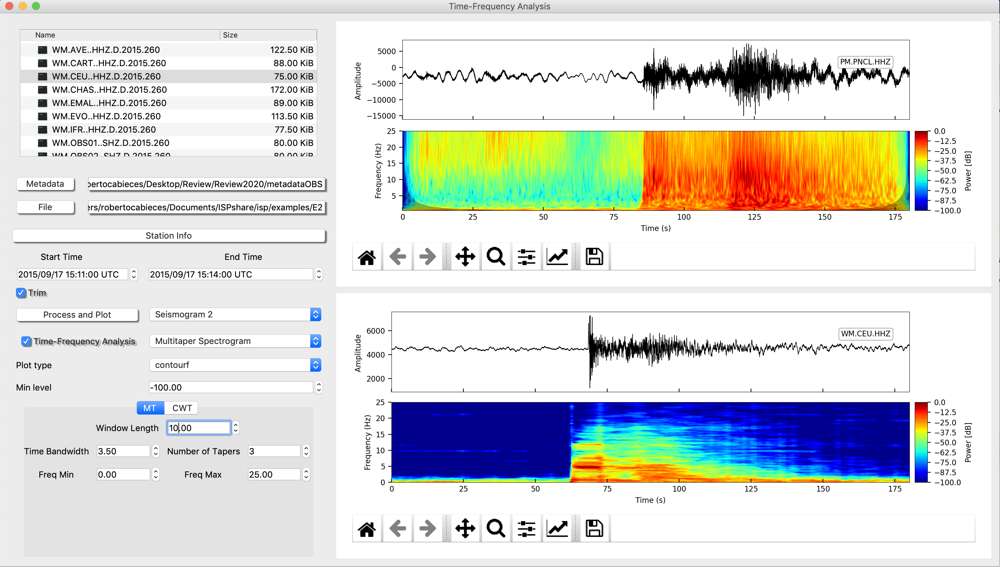
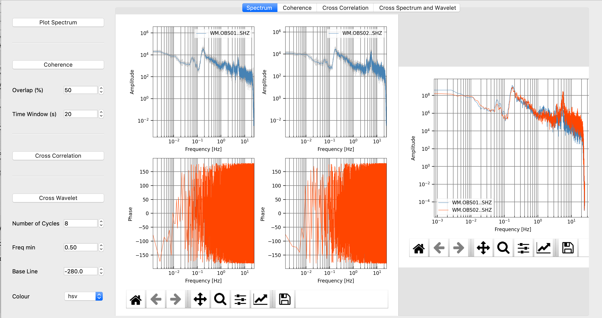
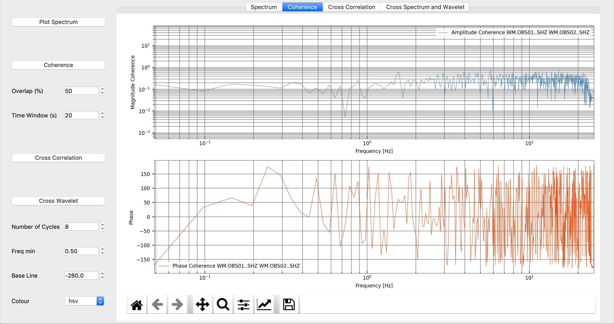
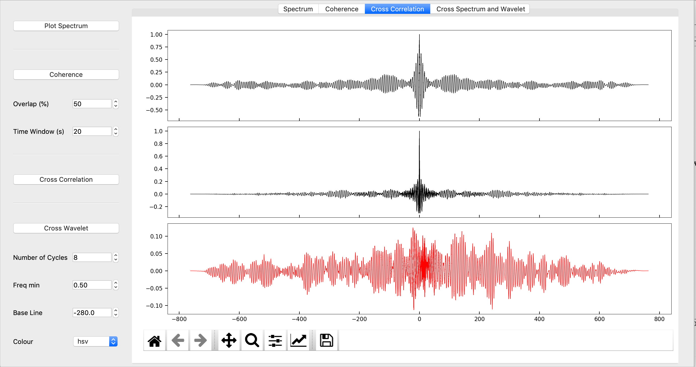
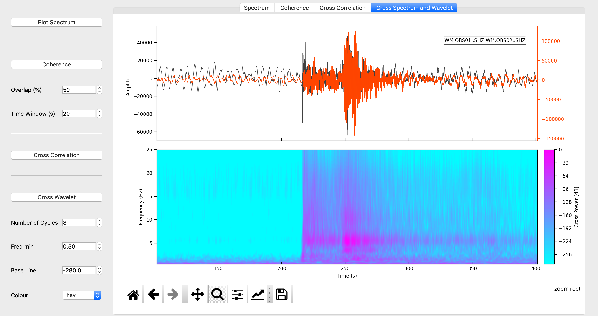
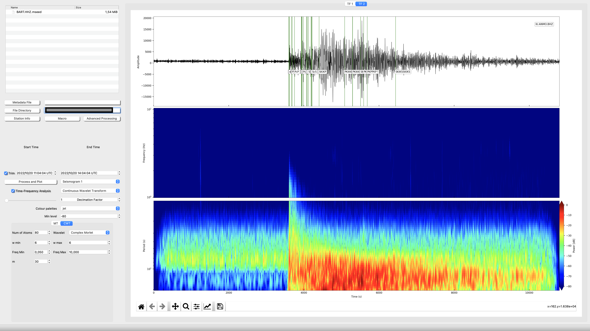

# Time-Frequency Analysis

## Multitaper, CWT and Wigner Distribution

The Time-Frequency Analysis window is designed to facilitate the computation of advanced seismic signal processes  on individual seismograms.
The seismograms are selected in the files explorer. You can also set a macro with basic process before running any time-Frequency analysis

The most important is the selection of the Seismogram (the analysis will be show in the upper panel . “seismogram 1” and lower panel seismogram 2). Then you can select which one of Time-Frequency analysis you want to compute.
Before Compute the Time-Frequency analysis be sure that you have filled the parameters of that kind of analysis (MT for multitaper spectrogram and CWT for Continuous Wavelet Transform).
With respect to the Wavelet:
The wavelet needs, select the wavelet (Morlet, Paul or Mexican Hat are available) and fill the parameters in accordance to the selected wavelet (Mallat, 2009).
With respect to the Multitaper (Thomson, 1982):
His analysis needs to specify the Window Length, Time-Bandwidth, the Number of Tapers and the range of the frequencies

## Advanced TF analysis (two seismograms at once)

In the Figures are shown an example of computation of CWT and the uncertainty cone using the Morlet wavelet (upper panel) and multitaper spectrogram (lower panel). In the multimedia material can be found an example of how to mange the TF framework.

Once two seismograms are selected we can follow with more advanced signal processing (Open advanced analysis):

- Spectrum Comparison >>> plot the amplitude and phase spectrum individual and together (Fig. 2).

- Coherence >>> Plot the magnitude square coherence and its phase (Fig. 3).

- Cross Correlation >>> Plot the Autocorrelations and the cross correlation of both signals (Fig. 4).

- Cross Wavelet >>> Plot the Cross-CWT of both signals (Fig. 5).

## Connect with Earthquake Analysis

Super easy, when you have a waveform plot in Earquake analysis, hold your mouse over the waveform and press "**m**". This action will save your waveform data to be ready to send it to TF Analysis. A wavelet symbol will appear in the bottom left corner of the waveform plot.

 Now just, click over the the symbol of TF Anlysis icon in the Upper part of the widget 

This action will open TF Analysis and will launch Seismogram 3. Split into Long period and High frequency running the CWT. If you have loeaded the metadata and fill the event box, the travel times will also be shown. 

## Multimedia Material (Time-Frequency Analysis)

The following video shows a basic analysis of an earthquake
<!-- blank line -->
<figure class="video_container">
  <video controls="true" allowfullscreen="true" poster="../img/poster_image.png" width="740" height="400">
    <source src="../img/TF_Analysis.mp4" type="video/mp4">
  </video>
</figure>
<!-- blank line -->

## Shortcuts

|	Shortcut	     |	Action          |
|---------------------|:-----------------|
|     'q'             |    	Set start time |
|     'w'             |    	Process and Plot |
|     'e'             |    	Set end time |

